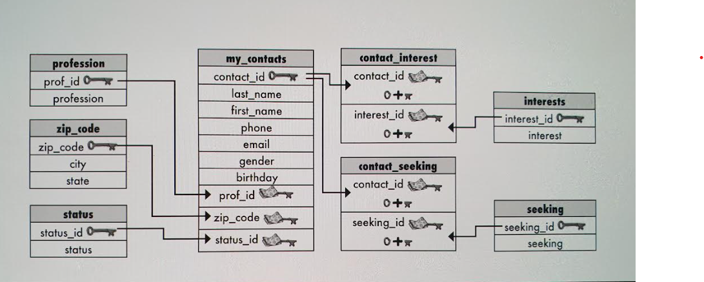

# `100 Oracle SQL Exercises`


[Joseph Anthony Debono](https://github.com/jadebono).  
Email [Joseph](joe@jadebono.com).

These exercises have been adapted for Oracle SQL, will use syntax specific to Oracle SQL.

To return to the readme file: [README](./README.md).

---

## `List of Resources and Links`

1. [OracleTutorial](https://www.oracletutorial.com/);
1. [Oracle Codebox](https://livesql.oracle.com/).

---

## `General Practice Notes`

1. Oracle SQL syntax and keywords may differ from other interpretations of SQL;
1. Indent using spaces to make your code clearer to read;
1. Use single quotes '' not double quotes "" to encapsulate strings and string-type data;
1. The semicolon ; is used to end a sequence of SQL commands or query. When the Relational Database Management System (RDMS) sees the ; it knows that the query terminates there and that there is nothing else outstanding;
1. Column names and groups of columns are separated by a comma , except the last one in a sequence;
1. Use underscores for spaces;
1. SQL is case insensitive but the convention is generally to use uppercase for SQL key words.

---

## `Oracle SQL datatypes`

These are the main datatypes of Oracle SQL:

### Character Datatypes

1. **CHAR(size)**: Fixed-length character data of length size bytes.
1. **VARCHAR2(size)**: Variable-length character data with a maximum length of size bytes.
1. **NCHAR(size)**: Fixed-length national character set data.
1. **NVARCHAR2(size)**: Variable-length national character set data.

### Number Datatypes

1. **NUMBER(p,s)**: Numeric values with precision p and scale s.
1. **FLOAT(p)**: Floating-point numbers with a precision of p.
1. **BINARY_FLOAT**: Single-precision floating-point number.
1. **BINARY_DOUBLE**: Double-precision floating-point number.

### Date/Time Datatypes

1. **DATE**: Date and time values (year, month, day, hour, minute, second).
1. **TIMESTAMP**: Extension of DATE datatype with fractional seconds.
1. **TIMESTAMP WITH TIME ZONE**: Timestamp with a time zone displacement.
1. **TIMESTAMP WITH LOCAL TIME ZONE**: Timestamp normalized to the database time zone.
1. **INTERVAL YEAR TO MONTH**: Stores a difference in years and months.
1. **INTERVAL DAY TO SECOND**: Stores a difference in days, hours, minutes, and seconds.

### Large Object (LOB) Datatypes

1. **BLOB**: Binary Large Object, for storing binary data.
1. **CLOB**: Character Large Object, for storing large amounts of character data.
1. **NCLOB**: National Character Large Object, for storing large amounts of national character set data.
1. **BFILE**: External binary file stored outside the database.

### RAW and Long RAW Datatypes

1. **RAW(size)**: Raw binary data of length size bytes.
1. **LONG RAW**: Variable-length raw binary data up to 2 GB.

### Rowid Datatypes

1. **ROWID**: Base 64 string representing the unique address of a row in the database.
1. **UROWID**: Universal ROWID, used for tables with user-defined unique identifiers.

For more information:

[Oracle SQL Datatypes](https://docs.oracle.com/en/database/oracle/oracle-database/19/sqlqr/Data-Types.html#GUID-F5148A9D-3098-4067-935A-9F670991A541)  
[Oracle Data Typesw - W3](https://www.w3resource.com/oracle/oracle-data-types.php)

---

## `Oracle string functions`

Common String Functions in Oracle SQL

### ASCII(char)

- Returns the ASCII code of the character.
- Example:
  ```sql
  SELECT ASCII('A') FROM dual;  -- Returns 65
  ```

### CHR(number)

- Returns the character corresponding to the ASCII code.
- Example:
  ```sql
  SELECT CHR(65) FROM dual;  -- Returns 'A'
  ```

### CONCAT(string1, string2)

- Concatenates two strings.
- Example:
  ```sql
  SELECT CONCAT('Hello', ' World') FROM dual;  -- Returns 'Hello World'
  ```

### INSTR(string, substring, [start_position], [occurrence])

- Returns the position of a substring within a string.
- Example:
  ```sql
  SELECT INSTR('Hello World', 'o') FROM dual;  -- Returns 5
  ```

### LENGTH(string)

- Returns the length of the string.
- Example:
  ```sql
  SELECT LENGTH('Hello World') FROM dual;  -- Returns 11
  ```

### LOWER(string)

- Converts a string to lowercase.
- Example:
  ```sql
  SELECT LOWER('HELLO WORLD') FROM dual;  -- Returns 'hello world'
  ```

### UPPER(string)

- Converts a string to uppercase.
- Example:
  ```sql
  SELECT UPPER('hello world') FROM dual;  -- Returns 'HELLO WORLD'
  ```

### LPAD(string, length, [pad_string])

- Pads the left side of a string with a specified character to a certain length.
- Example:
  ```sql
  SELECT LPAD('Hello', 10, '*') FROM dual;  -- Returns '*****Hello'
  ```

### RPAD(string, length, [pad_string])

- Pads the right side of a string with a specified character to a certain length.
- Example:
  ```sql
  SELECT RPAD('Hello', 10, '*') FROM dual;  -- Returns 'Hello*****'
  ```

### LTRIM(string, [trim_string])

    - Removes characters from the left side of a string.
    - Example:
      ```sql
      SELECT LTRIM('***Hello', '*') FROM dual;  -- Returns 'Hello'
      ```

### RTRIM(string, [trim_string])

    - Removes characters from the right side of a string.
    - Example:
      ```sql
      SELECT RTRIM('Hello***', '*') FROM dual;  -- Returns 'Hello'
      ```

### REPLACE(string, search_string, replace_string)

    - Replaces occurrences of a substring within a string with another substring.
    - Example:
      ```sql
      SELECT REPLACE('Hello World', 'World', 'Oracle') FROM dual;  -- Returns 'Hello Oracle'
      ```

### SUBSTR(string, start_position, [length])

    - Extracts a substring from a string starting at a specified position.
    - Example:
      ```sql
      SELECT SUBSTR('Hello World', 7, 5) FROM dual;  -- Returns 'World'
      ```

### INITCAP(string)

    - Converts the first letter of each word in a string to uppercase and all other letters to lowercase.
    - Example:
      ```sql
      SELECT INITCAP('hello world') FROM dual;  -- Returns 'Hello World'
      ```

### TRIM([LEADING|TRAILING|BOTH] trim_string FROM string)

    - Removes specified characters from the beginning, end, or both sides of a string.
    - Example:
      ```sql
      SELECT TRIM('*' FROM '*Hello*') FROM dual;  -- Returns 'Hello'
      ```

### INSTRB(string, substring, [start_position], [occurrence])

    - Similar to `INSTR`, but counts bytes rather than characters.
    - Example:
      ```sql
      SELECT INSTRB('Hello World', 'o') FROM dual;  -- Returns 5
      ```

### SUBSTRB(string, start_position, [length])

    - Similar to `SUBSTR`, but extracts bytes rather than characters.
    - Example:
      ```sql
      SELECT SUBSTRB('Hello World', 7, 5) FROM dual;  -- Returns 'World'
      ```

### SOUNDEX(string)

    - Returns a phonetic representation of a string.
    - Example:
      ```sql
      SELECT SOUNDEX('Hello') FROM dual;  -- Returns 'H400'
      ```

### TO_CHAR(expr, [format])

    - Converts a number or date to a string in a specified format.
    - Example:
      ```sql
      SELECT TO_CHAR(SYSDATE, 'YYYY-MM-DD') FROM dual;  -- Returns current date in 'YYYY-MM-DD' format
      ```

### Example Queries

To illustrate how these functions can be used in practice, let's look at some example queries.

#### Example 1: Concatenate and Convert to Uppercase

```sql
SELECT UPPER(CONCAT('Hello', ' World')) AS greeting FROM dual;
-- Returns 'HELLO WORLD'
```

#### Example 2: Find and Extract Substring

```sql
SELECT SUBSTR('Oracle SQL', INSTR('Oracle SQL', 'S'), 3) AS substring FROM dual;
-- Returns 'SQL'
```

#### Example 3: Pad and Trim String

```sql
SELECT TRIM('*' FROM LPAD('Hello', 10, '*')) AS padded_trimmed FROM dual;
-- Returns 'Hello'
```

Notes:

1. In Oracle SQL, `dual` is a special dummy table that is used primarily for selecting pseudo columns or performing calculations. It exists in every Oracle Database and is accessible to all users. The table has one row and one column named DUMMY, which has a value of 'x';
1. **IMPORTANT**: string functions do NOT change the data stored in your table, the simply return the altered strings as a result of the query. However, you can then take the returned strings and use them to _alter_ the data in the columns.

---

## `Question 1 - Introduction to Oracle Database`

Read this introduction to Oracle Database: [What is Oracle Database](https://www.oracletutorial.com/getting-started/what-is-oracle-database/)

Make sure you understand the difference between:

1. Enterprise Edition;
1. Standard Edition;
1. Expression Edition.

---

## `Question 2 - Download and install Oracle Database 23ai Free`

1. Read [Oracle Database Free Get Started](https://www.oracle.com/database/free/get-started/);
1. Install the version required for your setup.

N.B. - Windows users will need to run Oracle Database Free using:

1. The provided container image and Docker Desktop for Windows;
1. Oracle VM VirtualBox Image.

A Windows native installation is coming soon

Note:

1. It's a good idea to download a data modeler to help you design databases later on. Oracle has an excellent one: [SQL Developer Data Modeler 23.1](https://www.oracle.com/database/sqldeveloper/technologies/sql-data-modeler/download/).

To connect to Oracle Database Free read the `Connecting to Oracle Database Free' section on this page.

## `Question 2a (Optional) - Download an Oracle sample database`

Download a free Oracle sample database named OT which is based on a global fictitious company that sells computer hardware including storage, motherboard, RAM, video card and CPU.

1. Read [Oracle Sample Database](https://www.oracletutorial.com/getting-started/oracle-sample-database/);
1. Download [Download Oracle Sample database](https://www.oracletutorial.com/wp-content/uploads/2019/01/oracle-sample-database.zip).

---

## `Question 3 - Creating Oracle sample database for practice`

Read and practice: [Creating Oracle Sample Database for Practice](https://www.oracletutorial.com/getting-started/create-oracle-sample-database-for-practice/).

---

## `Question 4 - Connecting to Oracle database with SQL*Plus`

SQL\*Plus is an interactive query tool installed automatically when you install Oracle Database Server or Client. SQL\*Plus has a command-line interface that allows you to connect to the Oracle Database server and execute statements interactively.

Read and try: [Connect to Oracle Database](https://www.oracletutorial.com/getting-started/connect-to-oracle-database/).

**IMPORTANT**: If you cannot get Oracleto work, either with or without SQL\*Plus, you can use [Oracle CodeBox](https://livesql.oracle.com/) as an online playground. You will however need an Oracle account to use it.

---

# `Single-Table Databases`

---

## `Question 5 - Create a new database and start using it`

Start your SQL Relational Database Management System (RDMS). You should be using SQL\*Plus. Create a database called gregs_list.

Notes:

1. Creating the database is not enough. You need to tell SQL to use it.

Solution:

```sql
create database gregs_list;
use gregs_list;
```

---

# `Independent Tables`

---

## `Question 6 - Create a new table`

Create a new table called `my_contacts`. The table should have the following columns:

1. ID of datatype number. Give this the attribute of not null and set it as the primary key;
1. To define id as primary key, at the end of the columns define it so: primary key (id)
1. LAST_NAME of datatype varchar2 with length 30;
1. FIRST_NAME of datatype varchar2 with length 20;
1. EMAIL of datatype varchar2 with length 50;
1. BIRTHDAY of datatype date;
1. PROFESSION of datatype varchar2 with length 50;
1. LOCATION of datatype varchar2 with length 50;
1. STATUS of datatype varchar2 with length 20;
1. INTERESTS of datatype varchar2 with length 100;
1. SEEKING of datatype varchar2 with length 100.

Notes:

1. While a primary key is not strictly necessary, it is good practice to include a primary key in all tables, perhaps even more than 1;
1. The datatype number is an integer. In this case we are using it as the primary key and therefore it MUST contain a value, In fact we add the constraint _not null_ to ensure that a value in inputted in this field. Moreover, since we've specified that his field is a primary key, it MUST contain a unique value and therefore it must contain a such a value. _not _ null\* ensures that it contains a value and that value must be unique;
1. Constraints are keywords that specify rules for the data in a table;
1. The datatype varchar2 allows a variable-length character string in the database character set. You specify the the database character set when you create your database. The default character set of Oracle is AL32UTF8;
1. To find out the character set of your oracle database, use this code:

```sql
select parameter, value
from nls_database_parameters
where parameter  = 'NLS_CHARACTERSET';
```

1. varchar2 allows you to specify column length as either BYTE or CHAR. Default if left out is char (character) and max length is 255;
1. varchar2 characters are inputted in single quotes;
1. Date is another datatype allowing the input of data. Default input for this data type is '1-JAN-90'. Single quotes are necessary too. The abbreviations for the months are JAN, FEB, MAR, APR, MAY, JUN, AUG, SEP, OCT, NOV, DEC (Note: This is NOT the only way of inputting date but this will do for now);
1. columns are expressed in () and separated by , the comma;
1. Learn to indent with spaces to keep the code readable.

Solution:

```sql
create table my_contacts (
    id number not null,
    -- all the following varchar2 columns are characters not bytes
    last_name varchar2(30),
    first_name varchar2(20),
    email varchar2(50),
    birthday date,
    profession varchar2(50),
    location varchar2(50),
    status varchar2(20),
    interests varchar2(100),
    seeking varchar2(100),
    primary key (id)
);
```

---

## `Question 7 - Describe your new table`

Retrieve the form of your my_contacts table.

Notes:
Use the keyword _describe_

Solution:

```sql
describe my_contacts;
```

---

## `Question 8 - Delete your new table`

Delete your new table and create it again.

Notes:

1.  To delete your table use the keywords _drop_ _table_ `my_table`.

Solution:

```sql
drop table my_contacts;
```

Now recreate the table again exactly as is in Question 6

---

## `Question 9 - Insert a row into your new table`

Insert a record into your 'my_contacts' table.

Notes:

1. The keywords used are `insert into 'your_table' (column_1, column_2, column_n) values (data, data, data_n)`;
1. The values of each column must be written down in the same order as the order of the columns.

Solution:

```sql
insert into my_contacts (id, last_name, first_name, email, birthday, profession, location, status, interests, seeking)
values
(0, 'Borg', 'Alex', 'alex@borg.com', '1-JAN-90', 'software dev', 'Malta', 'Single', 'computers', 'women for dating');
```

---

## `Question 10 - Insert a row with a null value into your new table`

Insert a record with a null value into your new table.

Notes:

1. To do so, simply use the keyword _null_ as a constraint in place of the data that you would otherwise have inserted.

Solution:

```sql
insert into my_contacts (id, last_name, first_name, email, birthday, profession, location, status, interests, seeking)
values
(1, 'Callus', 'Jason', 'jason@callus.com', null, 'baker', null, null, 'festi', null);
```

---

## `Question 11 - View all the records in your table`

View all the records in your table

1. Use the keywords _select_ from your_table;
1. The \* requests the query to retrieve ALL records from your table;
1. \* in Oracle SQL is called "star".

Solution:

```sql
select *
from my_contacts;
```

---

## `Question 12 - Delete all records in your table`

Delete all records from your table.

1. Use the keyword _truncate_ to do so;
1. You also need to use the keyword _table_ to execute this query.

Solution:

```sql
truncate table my_contacts;
```

---

## `Question 13 - Insert 11 more records into your table with one simultaneous query`

Insert 10 records into your table.

Hints:

1. The syntax is exactly the same as for inserting a single row BUT the syntax must be repeated for every row;
1. Each record should contain its data within brackets ();
1. Each row is inserted as part of an independent query so end each row with a semicolon.

Solution:

```sql
insert into my_contacts (id, last_name, first_name, email, birthday, profession, location, status, interests, seeking)
values
(0, 'Ayle', 'Alex', 'alex@gmail.com', '1-JAN-90', 'lawyer', 'Argentina', 'Single', 'politics', 'women for dating');
insert into my_contacts (id, last_name, first_name, email, birthday, profession, location, status, interests, seeking)
values
(1, 'Beeble', 'Bob', 'bob@gmail.com', '5-FEB-88', 'teacher', 'Belgium', 'Married', 'History', 'international friends');
insert into my_contacts (id, last_name, first_name, email, birthday, profession, location, status, interests, seeking)
values
(2, 'Carlson', 'Charles', 'charles@gmail.com', '10-MAR-92', 'fireman', 'Canada', 'Married', 'Hunting', 'hunting buddies');
insert into my_contacts (id, last_name, first_name, email, birthday, profession, location, status, interests, seeking)
values
(3, 'Dray', 'David', 'david@gmail.com', '15-APR-94', 'journalist', 'Denmark', 'Single', 'Reading', 'women for dating');
insert into my_contacts (id, last_name, first_name, email, birthday, profession, location, status, interests, seeking)
values
(4, 'Eliah', 'Elton', 'elton@gmail.com', '20-MAY-94', 'engineer', 'England', 'Married', 'Whisky', 'Drinking buddies');
insert into my_contacts (id, last_name, first_name, email, birthday, profession, location, status, interests, seeking)
values
(5, 'Faulk', 'Francis', 'francis@gmail.com', '25-JUN-88', 'software dev', 'Francis', 'Single', 'computer rpgs', 'women for dating');
insert into my_contacts (id, last_name, first_name, email, birthday, profession, location, status, interests, seeking)
values
(6, 'Goodson', 'George', 'george@gmail.com', '30-JULY-90', 'architect', 'Greece', 'Single', 'art', 'women for dating');
insert into my_contacts (id, last_name, first_name, email, birthday, profession, location, status, interests, seeking)
values
(7, 'Helt', 'Hazel', 'hazel@gmail.com', '1-AUG-91', 'medical doctor', 'Hungary', 'Married', 'gastronomy', 'dining out');
insert into my_contacts (id, last_name, first_name, email, birthday, profession, location, status, interests, seeking)
values
(8, 'Iveson', 'Ivy', 'ivy@gmail.com', '5-SEP-89', 'pilot', 'India', 'Married', 'travel', 'travel groups');
insert into my_contacts (id, last_name, first_name, email, birthday, profession, location, status, interests, seeking)
values
(9, 'Jicks', 'Jackie', 'jackie@gmail.com', '10-OCT-93', 'executive', 'Jordan', 'Single', 'fashion', 'men for dating');
insert into my_contacts (id, last_name, first_name, email, birthday, profession, location, status, interests, seeking)
values
(10, 'Ktesiphon', 'Kalkos', 'kalkos@gmail.com', '15-NOV-91', 'military', 'Greece', 'Married', 'ships', 'promotion');
insert into my_contacts (id, last_name, first_name, email, birthday, profession, location, status, interests, seeking)
values
(11, 'Larand', 'Lemmuel', 'Lemmuel@gmail.com', '10-DEC-95', 'digital marketing', 'Scotland', 'Single', 'fishing', 'women for dating');
```

---

## `Question 14 - Delete the current table and recreate it to ensure that all columns require a value`

First delete the current iteration of the `my_contacts` table. Then create it such that every column is required to carry a value. Then populate it with all the records in Question 13, following which describe the table and finally retrieve the records of the new table. Chain all queries into one script (a script is a sequence of queries).

Hint:

1. If you don't know how to require a column to have a value, check out the solution to question 6.

Solution:

```sql
drop table my_contacts;

create table my_contacts (
    id number not null,
    last_name varchar2(30) not null,
    first_name varchar2(20) not null,
    email varchar2(50) not null,
    birthday date  not null,
    profession varchar2(50) not null,
    location varchar2(50) not null,
    status varchar2(20) not null,
    interests varchar2(100) not null,
    seeking varchar2(100)  not null,
    primary key (id)
);

insert into my_contacts (id, last_name, first_name, email, birthday, profession, location, status, interests, seeking)
values
(0, 'Ayle', 'Alex', 'alex@gmail.com', '1-JAN-90', 'lawyer', 'Argentina', 'Single', 'politics', 'women for dating');
insert into my_contacts (id, last_name, first_name, email, birthday, profession, location, status, interests, seeking)
values
(1, 'Beeble', 'Bob', 'bob@gmail.com', '5-FEB-88', 'teacher', 'Belgium', 'Married', 'History', 'international friends');
insert into my_contacts (id, last_name, first_name, email, birthday, profession, location, status, interests, seeking)
values
(2, 'Carlson', 'Charles', 'charles@gmail.com', '10-MAR-92', 'fireman', 'Canada', 'Married', 'Hunting', 'hunting buddies');
insert into my_contacts (id, last_name, first_name, email, birthday, profession, location, status, interests, seeking)
values
(3, 'Dray', 'David', 'david@gmail.com', '15-APR-94', 'journalist', 'Denmark', 'Single', 'Reading', 'women for dating');
insert into my_contacts (id, last_name, first_name, email, birthday, profession, location, status, interests, seeking)
values
(4, 'Eliah', 'Elton', 'elton@gmail.com', '20-MAY-94', 'engineer', 'England', 'Married', 'Whisky', 'Drinking buddies');
insert into my_contacts (id, last_name, first_name, email, birthday, profession, location, status, interests, seeking)
values
(5, 'Faulk', 'Francis', 'francis@gmail.com', '25-JUN-88', 'software dev', 'Francis', 'Single', 'computer rpgs', 'women for dating');
insert into my_contacts (id, last_name, first_name, email, birthday, profession, location, status, interests, seeking)
values
(6, 'Goodson', 'George', 'george@gmail.com', '30-JULY-90', 'architect', 'Greece', 'Single', 'art', 'women for dating');
insert into my_contacts (id, last_name, first_name, email, birthday, profession, location, status, interests, seeking)
values
(7, 'Helt', 'Hazel', 'hazel@gmail.com', '1-AUG-91', 'medical doctor', 'Hungary', 'Married', 'gastronomy', 'dining out');
insert into my_contacts (id, last_name, first_name, email, birthday, profession, location, status, interests, seeking)
values
(8, 'Iveson', 'Ivy', 'ivy@gmail.com', '5-SEP-89', 'pilot', 'India', 'Married', 'travel', 'travel groups');
insert into my_contacts (id, last_name, first_name, email, birthday, profession, location, status, interests, seeking)
values
(9, 'Jicks', 'Jackie', 'jackie@gmail.com', '10-OCT-93', 'executive', 'Jordan', 'Single', 'fashion', 'men for dating');
insert into my_contacts (id, last_name, first_name, email, birthday, profession, location, status, interests, seeking)
values
(10, 'Ktesiphon', 'Kalkos', 'kalkos@gmail.com', '15-NOV-91', 'military', 'Greece', 'Married', 'ships', 'promotion');
insert into my_contacts (id, last_name, first_name, email, birthday, profession, location, status, interests, seeking)
values
(11, 'Larand', 'Lemmuel', 'Lemmuel@gmail.com', '10-DEC-95', 'digital marketing', 'Scotland', 'Single', 'fishing', 'women for dating');

desc my_contacts;

select * from my_contacts;
```

---

## `Question 15 - Define default values for the LOCATION column`

Delete your table and create it anew giving the LOCATION column a default value of 'UK' as a constraint. Then fill in the records in Question 14 with the default location for the following individuals:

(2, Carlson, Charles),
(4, Eliah, Elton),
(5, Faulk, Francis)

Finally run a desc query and retrieve all records.

Notes:

1. Use the _default_ keyword with the default value constraint required in the _create_ _table_ query;
2. When you insert the records, in the values brackets replace the location with _default_.

Hint:

1. If you are defining a field with a default value constraint, it should stand to reason that specifying _not_ _null_ is unnecessary.

Solution:

```sql
drop table my_contacts;

create table my_contacts (
    id number not null,
    last_name varchar2(30) not null,
    first_name varchar2(20) not null,
    email varchar2(50) not null,
    birthday date  not null,
    profession varchar2(50) not null,
    location varchar2(50) default 'UK',
    status varchar2(20) not null,
    interests varchar2(100) not null,
    seeking varchar2(100)  not null,
    primary key (id)
);

insert into my_contacts (id, last_name, first_name, email, birthday, profession, location, status, interests, seeking)
values
(0, 'Ayle', 'Alex', 'alex@gmail.com', '1-JAN-90', 'lawyer', 'Argentina', 'single', 'politics', 'women for dating');
insert into my_contacts (id, last_name, first_name, email, birthday, profession, location, status, interests, seeking)
values
(1, 'Beeble', 'Bob', 'bob@gmail.com', '5-FEB-88', 'teacher', 'Belgium', 'married', 'history', 'international friends');
insert into my_contacts (id, last_name, first_name, email, birthday, profession, location, status, interests, seeking)
values
(2, 'Carlson', 'Charles', 'charles@gmail.com', '10-MAR-92', 'fireman', default, 'married', 'hunting', 'hunting buddies');
insert into my_contacts (id, last_name, first_name, email, birthday, profession, location, status, interests, seeking)
values
(3, 'Dray', 'David', 'david@gmail.com', '15-APR-94', 'journalist', 'Denmark', 'single', 'reading', 'women for dating');
insert into my_contacts (id, last_name, first_name, email, birthday, profession, location, status, interests, seeking)
values
(4, 'Eliah', 'Elton', 'elton@gmail.com', '20-MAY-94', 'engineer', default, 'married', 'whisky', 'Drinking buddies');
insert into my_contacts (id, last_name, first_name, email, birthday, profession, location, status, interests, seeking)
values
(5, 'Faulk', 'Francis', 'francis@gmail.com', '25-JUN-88', 'software dev', default, 'single', 'computer rpgs', 'women for dating');
insert into my_contacts (id, last_name, first_name, email, birthday, profession, location, status, interests, seeking)
values
(6, 'Goodson', 'George', 'george@gmail.com', '30-JULY-90', 'architect', 'Greece', 'single', 'art', 'women for dating');
insert into my_contacts (id, last_name, first_name, email, birthday, profession, location, status, interests, seeking)
values
(7, 'Helt', 'Hazel', 'hazel@gmail.com', '1-AUG-91', 'medical doctor', 'Hungary', 'married', 'gastronomy', 'dining out');
insert into my_contacts (id, last_name, first_name, email, birthday, profession, location, status, interests, seeking)
values
(8, 'Iveson', 'Ivy', 'ivy@gmail.com', '5-SEP-89', 'pilot', 'India', 'married', 'travel', 'travel groups');
insert into my_contacts (id, last_name, first_name, email, birthday, profession, location, status, interests, seeking)
values
(9, 'Jicks', 'Jackie', 'jackie@gmail.com', '10-OCT-93', 'executive', 'Jordan', 'single', 'fashion', 'men for dating');
insert into my_contacts (id, last_name, first_name, email, birthday, profession, location, status, interests, seeking)
values
(10, 'Ktesiphon', 'Kalkos', 'kalkos@gmail.com', '15-NOV-91', 'military', 'Greece', 'married', 'ships', 'promotion');
insert into my_contacts (id, last_name, first_name, email, birthday, profession, location, status, interests, seeking)
values
(11, 'Larand', 'Lemmuel', 'Lemmuel@gmail.com', '10-DEC-95', 'digital marketing', default, 'single', 'fishing', 'women for dating');

desc my_contacts;

select * from my_contacts;
```

---

## `Question 16 - Create a new table with a column with a default value`

Create a new table called `doughnut_list`. The table should have four columns: ID which should be the primary key, DOUGHNUT_NAME (varchar2(10)), DOUGHNUT_TYPE (varchar2(10)), both of which should be _not null_. Add a column called DOUGHNUT_COST which should be a float of 3 numbers with 2 behind the decimal point. DOUGHNUT_COST should have a default value of 1.00. Then fill them with these records:

(0, Blooberry, filled, 2.12)  
(1, Cinnamondo, ring, 1.35)  
(2, Rockstar, cruller, 1.35)  
(3, Carameller, cruller, 1.35)  
(4, Appleblush, filled, 1.44)

Notes:

1. to create a float consisting of 3 digits of which 2 come after the decimal point, use number(3,2)

Hint:

1. If you use a round number with number(3,2), it will render it as an integer, hence 1.00 => 1.

Solution:

```sql
create table doughnut_list (
    id number not null,
    doughnut_name varchar2(10) not null,
    doughnut_type varchar2(7) not null,
    doughnut_cost number(3,2) default 1.35,
    primary key (id)
);

insert into doughnut_list (id, doughnut_name, doughnut_type, doughnut_cost) values (0, 'Blooberry', 'filled', 2.12);
insert into doughnut_list (id, doughnut_name, doughnut_type, doughnut_cost) values (1, 'Cinnamondo', 'ring', default);
insert into doughnut_list (id, doughnut_name, doughnut_type, doughnut_cost) values (2, 'Rockstar', 'cruller', default);
insert into doughnut_list (id, doughnut_name, doughnut_type, doughnut_cost) values (3, 'Carameller', 'cruller', default);
insert into doughnut_list (id, doughnut_name, doughnut_type, doughnut_cost) values (4, 'Appleblush', 'filled', 1.43);

desc doughnut_list;

select * from doughnut_list;
```

---

## `Question 17 - Create a new table called easy_drinks`

Create a table called `easy_drinks`. The table should have the following columns: DRINK_NAME, MAIN, AMOUNT1, SECOND, AMOUNT2, DIRECTIONS. Add an ID as primary key. Fill it with the following values:

(0, 'Blackthorn', 'tonic water', 1.5, 'pineapple juice', 1, 'stir with ice, strain into cocktail glass with lemon twist')  
(1, 'Blue Moon', 'soda', 1.5, 'blueberry juice', .75, 'stir with ice, strain into cocktail glass with lemon twist')  
(2, 'Oh My Gosh', 'peach nectar', 1, 'pineapple juice', 1, 'stir with ice, strain into shot glass')  
(3, 'Lime Fizz', 'sprite', 1.5, 'lime juice', .75, 'stir with ice, strain into cocktail glass')  
(4, 'Kiss on the Lips', 'cherry juice', 2, 'apricot nectar', 7, 'serve over ice with straw')  
(5, 'Hot Gold', 'peach nectar', 3, 'orange juice', 6, 'pour hot orange juice in mug and add peach nectar')  
(6, 'Lone Tree', 'soda', 1.5, 'cherry juice', .75, 'stir with ice, strain into cocktail glass')  
(7, 'Greyhound', 'soda', 1.5, 'grapefruit juice', 5, 'serve over ice, st ir well')  
(8, 'Indian Summer', 'apple juice', 2, 'hot tea', 6, 'add juice to mug and top off with hot tea')  
(9, 'Bull Frog', 'iced tea', 1.5, 'lemonade', 5, 'serve over ice with lime slice')  
(10, 'Soda and It', 'soda', 2, 'grape juice', 1, 'shake in cocktail glass, no ice')

Then describe it and finally retrieve all records. Chain all queries into one script.

Hint:

1. Think carefully about the datatypes you need.

Solution:

```sql
create table easy_drinks (
    id number not null,
    drink_name varchar2(20) not null,
    main varchar2(20) not null,
    amount1 number(3,1) not null,
    second varchar2(20),
    amount2 number(4,2) default 0.75,
    directions varchar2(255),
    primary key (id)
);

insert into easy_drinks (id, drink_name, main, amount1, second, amount2, directions) values (0, 'Blackthorn', 'tonic water', 1.5, 'pineapple juice', 1, 'stir with ice, strain into cocktail glass with lemon twist');
insert into easy_drinks (id, drink_name, main, amount1, second, amount2, directions) values (1, 'Blue Moon', 'soda', 1.5, 'blueberry juice', 0.75, 'stir with ice, strain into cocktail glass with lemon twist');
insert into easy_drinks (id, drink_name, main, amount1, second, amount2, directions) values (2, 'Oh My Gosh', 'peach nectar', 1, 'pineapple juice', 1, 'stir with ice, strain into shot glass');
insert into easy_drinks (id, drink_name, main, amount1, second, amount2, directions) values (3, 'Lime Fizz', 'sprite', 1.5, 'lime juice', 0.75, 'stir with ice, strain into cocktail glass');
insert into easy_drinks (id, drink_name, main, amount1, second, amount2, directions) values (4, 'Kiss on the Lips', 'cherry juice', 2, 'apricot nectar', 7, 'serve over ice with straw');
insert into easy_drinks (id, drink_name, main, amount1, second, amount2, directions) values (5, 'Hot Gold', 'peach nectar', 3, 'orange juice', 6, 'pour hot orange juice in mug and add peach nectar');
insert into easy_drinks (id, drink_name, main, amount1, second, amount2, directions) values (6, 'Lone Tree', 'soda', 1.5, 'cherry juice', 0.75, 'stir with ice, strain into cocktail glass');
insert into easy_drinks (id, drink_name, main, amount1, second, amount2, directions) values (7, 'Greyhound', 'soda', 1.5, 'grapefruit juice', 5, 'serve over ice, stir well');
insert into easy_drinks (id, drink_name, main, amount1, second, amount2, directions) values (8, 'Indian Summer', 'apple juice', 2, 'hot tea', 6, 'add juice to mug and top off with hot tea');
insert into easy_drinks (id, drink_name, main, amount1, second, amount2, directions) values (9, 'Bull Frog', 'iced tea', 1.5, 'lemonade', 5, 'serve over ice with lime slice');
insert into easy_drinks (id, drink_name, main, amount1, second, amount2, directions) values (10, 'Soda and It', 'soda', 2, 'grape juice', 1, 'shake in cocktail glass, no ice');

desc easy_drinks;

select * from easy_drinks;
```

---

## `Question 18 - SELECT with WHERE`

In question 11, you learned how to select all records. Now retrieve all records from the my_contacts table in the column location of which the data is "UK".

Notes:

1. Use the _where_ keyword;
1. Conditions can be set up using logical operators.

Solution:

```sql
select *
from my_contacts
where location = 'UK';
```

---

## `Question 19 - Add conditions to your select query`

You can select records on the basis of multiple conditions if you use the _and_ keyword. Retrieve all records from `easy_drinks` where amount1 is 1.5 and amount2 is 0.75.

Solution:

```sql
select *
from easy_drinks
where amount1 = 1.5
    and amount2 = 0.75;
```

---

## `Question 20 - Select records with only a few of the columns of the table`

Repeat the previous query (Question 19) but this time retrieve only the data in the DRINK_NAME, MAIN, SECOND and DIRECTIONS columns.

Solution:

```sql
select drink_name, main, second
from easy_drinks
where amount1 = 1.5
    and amount2 = 0.75;
```

---

## `Question 21 - Delete a record from a table`

Delete a record from your `easy_drinks` table using _delete from_ and a condition defined by _where_. Delete the record with the ID of 0. Then delete all records in the table whose AMOUNT1 is equal to or less than 1.5 and AMOUNT2 is equal to or less than 1. Chain all queries into a single script.

Solution:

```sql
delete from easy_drinks
where id = 0;

select * from easy_drinks;

delete from easy_drinks
where amount1 <= 1.5
	and amount2 <= 1;

select * from easy_drinks;
```

---

## `Question 22 - Limiting the number of records retrieved`

You can choose how many records to retrieve even if there are more records that meet your retrieval criteria. Repeat the previous query but this time retrieve only one record of those that meet your retrieval criteria.

Hints:

1. You can use the _rownum_ keyword for this.

Solution:

```sql
select drink_name, main, second
from easy_drinks
where amount1 = 1.5
    and amount2 = 0.75
    and rownum = 1;
```

N.B. observe how sensible indentation makes the code much easier to read.

---

## `Question 23 - More on time and date`

Create a table called `coffee_reviews` with the following columns: ID (number), LOCATION (varchar2(255)), TIME_OF_DAY (timestamp), REVIEW_DATE (date), COFFEE_TYPE (varchar2(255)), RATING (number(2)) and COMMENTS (varchar2(255)).

Fill it with the following values:  
(0, 'Starbuzz Coffee', 7:43 am, 23/4/24, 'cinnamon glazed', 6, 'too much spice')  
(1, 'Duncan's Donuts', 8:56 am, 25/8/24, 'plain glazed', 5, 'greasy')  
(2, 'Duncan's Donuts', 7:58 pm, 26/4/24, 'jelly', 6, 'stale, but tasty')  
(3, 'Starbuzz Coffee', 10:35 pm, 24/4/24, 'plain glazed', 7, 'warm, but not hot')  
(4, 'Krispy King', 9:39 pm, 24/6/24, 'jelly', 6, 'not enough jelly')  
(5, 'Starbuzz Coffee', 7:48 am, 23/4/24, 'rocky road', 10, 'marshmallows!')  
(6, 'Krispy King', 8:56 am, 25/11/24, 'plain glazed', 8, 'maple syrup glaze')

Notes:

1. to use the _timestamp_ datatype, you use to_timestamp and supply it with both date and time in string format with the following format mask (with commas between date/time and format). For example, to input the timestamp of 10 January 2015 at 4:15 PM, you can use: to_timestamp('10-01-2015 16:15, 'DD-MM-YYYY HH24:MI:SS' ). Note that this will give you fractionalised seconds;
1. Similarly with the _date_ datatype, you can input it with your desired format mask. Example: to_date('23-04-2024', 'DD-MM-YYYY');
1. To escape a single quote such as here: 'Duncan's Donuts', use another one: 'Duncan''s Donuts'.

Solution:

```sql
CREATE TABLE coffee_reviews (
    id number not null,
    location varchar2(255) not null,
    time_of_day timestamp not null,
    review_date date not null,
    coffee_type varchar2(255) not null,
    rating number(2) not null,
    comments varchar2(255) not null,
    primary key (id)
);

insert into coffee_reviews (id, location, time_of_day, review_date, coffee_type, rating, comments) values (0, 'Starbuzz Coffee',  to_timestamp('23-04-2024 7:43:00', 'DD-MM-YYYY HH24:MI:SS'), to_date('23-04-2024', 'DD-MM-YYYY'), 'cinnamon glazed', 6, 'too much spice');
insert into coffee_reviews (id, location, time_of_day, review_date, coffee_type, rating, comments) values (1, 'Duncan''s Donuts', to_timestamp('25-08-2024 8:56:00', 'DD-MM-YYYY HH24:MI:SS'), to_date('25-08-2024', 'DD-MM-YYYY'), 'plain glazed', 5, 'greasy');
insert into coffee_reviews (id, location, time_of_day, review_date, coffee_type, rating, comments) values (2, 'Duncan''s Donuts', to_timestamp('26-04-2024 19:58:00', 'DD-MM-YYYY HH24:MI:SS'), to_date('26-04-2024', 'DD-MM-YYYY'), 'jelly', 6, 'stale, but tasty');
insert into coffee_reviews (id, location, time_of_day, review_date, coffee_type, rating, comments) values (3, 'Starbuzz Coffee',  to_timestamp('24-04-2024 22:35:00', 'DD-MM-YYYY HH24:MI:SS'), to_date('24-04-2024', 'DD-MM-YYYY'), 'plain glazed', 7, 'warm, but not hot');
insert into coffee_reviews (id, location, time_of_day, review_date, coffee_type, rating, comments) values (4, 'Krispy King', to_timestamp('26-04-2024 21:39:00', 'DD-MM-YYYY HH24:MI:SS'), to_date('26-04-2024', 'DD-MM-YYYY'), 'jelly', 6, 'not enough jelly');
insert into coffee_reviews (id, location, time_of_day, review_date, coffee_type, rating, comments) values (5, 'Starbuzz Coffee', to_timestamp('23-04-2024 7:48:00', 'DD-MM-YYYY HH24:MI:SS'), to_date('23-04-2024', 'DD-MM-YYYY'), 'rocky road', 10, 'marshmallows!');
insert into coffee_reviews (id, location, time_of_day, review_date, coffee_type, rating, comments) values (6, 'Krispy King', to_timestamp('25-11-2024 8:56:00', 'DD-MM-YYYY HH24:MI:SS'), to_date('25-11-2024', 'DD-MM-YYYY'), 'plain glazed', 8, 'maple syrup glaze');
```

---

## `Question 24 - Text data roping`

Oracle SQL can compare text data with comparison operators in a similar way to numeric values. The comparison operators evaluate everything alphabetically. From the table `easy_drinks`, retrieve all the drinks in the column DRINK_NAME that that begin with the letter L and the letter L ONLY.

Notes:

1. Case matters here. If the first letter in the field is lowercase, but you're searching by uppercase, it will not be retrieved even though the letter may not be the same;
1. The results may not be retrieved alphabetically. There will be exercises further down dealing with this issue.

Solution:

```sql
select * from easy_drinks
where drink_name >= 'L'
    and drink_name <= 'M';

```

---

## `Question 25 -The BETWEEN keyword`

Instead of constructing two clauses linked by _and_, use the keyword _between_ retrieve all drinks whose DRINK_NAME begins 'H' and begins with 'L'. Then write another query to retrieve all records whose AMOUNT1 column is between 1.5 and 2. Chain both queries into one script.

Notes:

1. The first part of this exercise is tricky because though Oracle SQL will retrieve records with data beginning with 'H', it will stop at the letter just before the second letter specified. In other words if the second letter specified is 'Z', the last record it retrieves will be that of data beginning with 'Y'.

Solution:

```sql
select * from easy_drinks
where drink_name between 'H' and 'M';

select * from easy_drinks
where amount1 between 1.5 and 2;
```

---

## `Question 26 - Selecting by OR`

Write a query to retrieve all records from `easy_drinks` that have 'cherry juice' in their MAIN OR SECOND columns. Retrieve only the data in column DRINK_NAME that satisfies these conditions

Solution:

```sql
select drink_name from easy_drinks
where main = 'cherry juice'
    or second = 'cherry juice';
```

---

## `Question 27 - Not equal`

Oracle SQL uses an operator to signify 'not equal' that is different from other computer languages. Write a query to retrieve all records from the `easy_drinks` table whose MAIN column is not equal to 'soda'.

Notes:

1. The 'not equal' operator in Oracle SQL is <>.

Solution:

```sql
select * from easy_drinks
where main <> 'soda';
```

---

## `Question 28 - Retrieving records with null values`

Create a table called `null_values_table`. Give it the following columns: ID, FIRST_NAME, LAST_NAME, HOBBIES. Fill it with some data leaving some fields in the HOBBIES column null. Then write a query to retrieve all those records with a null value in their HOBBIES column.

Notes:

1. The correct way of querying columns that have null values is by using the keywords _is null_.

Solution:

```sql
select * from null_values_table
where hobbies is null;
```

---

## `Question 29 - Wildcards and the LIKE keyword`

The _like_ keyword uses wildcards to search for data on the basis of partially supplied data. In the `my_contacts` table, retrieve all records with data starting with 'women' in the SEEKING column. Then write a query retrieving all records that end in 'oda' in the MAIN column in the `easy_drinks` table. Chain both queries into one script.

Notes:

1. You can use the % (percent) wildcard combined with your supplied data. For example 'women%' retrieves records of all data in the specified column that starts with the word 'women'. Inverting the position would retrieve records of all data in the specified column that ends with the word 'women';
1. The wildcard for a single character is the \_ (underscore) character;

Solution:

```sql
select * from my_contacts
where seeking like 'women%';

select * from easy_drinks
where main like '_oda';
```

---

## `Question 30 - The IN keyword`

Create a table called `black_book`with ID (number) DATE, NAME (varchar(20)) and RATING (varchar(20)) columns. Make them all _not_ _null_. ID should be the primary key.

Fill it with the following records:  
(0, 'Alex', 'innovative')  
(1, 'James', 'boring')  
(2, 'Ian', 'fabulous')  
(3, 'Boris', 'ho hum')  
(4, 'Melvin', 'plebeian')  
(5, 'Eric', 'pathetic')  
(6, 'Anthony', 'delightful')  
(7, 'Sammy', 'pretty good')  
(8, 'Ivan', 'dismal')  
(9, 'Vic', 'ridiculous')

Once you have created the table, retrieve all records that have a positive rating, i.e. innovative, fabulous, delightful, pretty good. Chain both queries into one script.

Notes:

1. Use the _in_ keyword and provide the list of matching data in brackets.

Solution:

```sql
create table black_book (
    id number not null,
    date_name varchar2(20) not null,
    rating varchar2(20) not null,
    primary key (id)
);

insert into black_book (id, date_name, rating) values (0, 'Alex', 'innovative');
insert into black_book (id, date_name, rating) values (1, 'James', 'boring');
insert into black_book (id, date_name, rating) values (2, 'Ian', 'fabulous');
insert into black_book (id, date_name, rating) values (3, 'Boris', 'ho hum');
insert into black_book (id, date_name, rating) values (4, 'Melvin', 'plebeian');
insert into black_book (id, date_name, rating) values (5, 'Eric', 'pathetic');
insert into black_book (id, date_name, rating) values (6, 'Anthony', 'delightful');
insert into black_book (id, date_name, rating) values (7, 'Sammy', 'pretty good');
insert into black_book (id, date_name, rating) values (8, 'Ivan', 'dismal');
insert into black_book (id, date_name, rating) values (9, 'Vic', 'ridiculous');

select *
from black_book
where rating in ('innovative', 'fabulous', 'delightful', 'pretty good');
```

---

## `Question 31 - NOT IN`

Write a query for the table `black_book` retrieving all records that do not have a positive rating.

Hint:

1. This will work similarly to the query in Question 29, but what you're looking for is _not_ _in_ the list of positive ratings.

Solution:

```sql
select *
from black_book
where rating not in ('innovative', 'fabulous', 'delightful', 'pretty good');
```

---

## `Question 32 - More uses of NOT`

Write a query retrieving all data from `easy_drinks` whose DRINK_NAME does NOT begin with a letter falling in the range between 'H' and begins with 'L'. Then write another query to retrieve all records from `my_contacts` whose SEEKING column has data that does not start with "women'. Chain both queries into one script.

Solution:

```sql
select *
from easy_drinks
where drink_name not between 'H' and 'M';

select *
from my_contacts
where seeking not like 'women%';
```

---

## `Question 33 - Similar records`

Create a table called `clown_info` with the following columns: ID (number), NAME (varchar2(20)), LAST_SEEN (varchar2(255)), APPEARANCE (varchar2(255)), ACTIVITIES (varchar2(255)). Only ID and NAME should be required. Then fill it with the following values:

(0, 'Elsie', 'Cherry Hill Senior Center', 'F, red hair, green dress, huge feet, balloons', 'little car')  
(1, 'Pickles','Jack Green's party', 'M, orange hair, blue suit, huge feet', 'mime')  
(2, 'Snuggles', 'Ball-Mart', 'F, yellow shirt, baggy red pants, horn', 'umbrella')  
(3, 'Mr. Hobo', 'BG Circus', 'M, cigar, black hair', 'tiny hat,violin')  
(4, 'Clarabelle', 'Belmont Senior Center', 'F, pink hair, huge flower, blue dress', 'yelling, dancing')  
(5, 'Scooter', 'Oakland Hospital', 'M, blue hair, red suit, huge nose', 'balloons')  
(6, 'Zippo', 'Millstone Mall', 'F, orange suit, baggy pants', 'dancing')  
(7, 'Babe,Earl's Autos', 'F, all pink and sparkly', 'balancing', 'little car')  
(8, 'Bonzo', null, 'M, in drag, polka dotted dress', 'singing, dancing')  
(9, 'Sniffles', 'Tracy's', 'M, green and purple suit, pointy nose', null)  
(10, 'Zippo', 'Millstone Mall', 'F, orange suit, baggy pants', 'dancing')  
(11, 'Zippo', 'Millstone Mall', 'F, orange suit, baggy pants', 'dancing, singling')  
(12, 'Zippo', 'Oakland Hospital', 'F, orange suit, baggy pants', 'dancing, singling')  
(13, 'Zippo', 'Tracy's', 'F, orange suit, baggy pants', 'dancing, singling')  
(14, 'Zippo', 'Ball-Mart', 'F, orange suit, baggy pants', 'dancing, singling')  
(15, 'Zippo', 'Millstone Mall', 'F, orange suit, baggy pants', 'dancing, singling')  
(16, 'Zippo', 'Oakland Hospital', 'F, orange suit, baggy pants', 'dancing, singling')

Solution:

```sql
create table clown_info (
    id number not null,
    name varchar2(20) not null,
    last_seen varchar2(255),
    appearance varchar2(255),
    activities varchar2(255)
);

insert into clown_info (id, name, last_seen, appearance, activities) values (0, 'Elsie', 'Cherry Hill Senior Center', 'F, red hair, green dress, huge feet, balloons', 'little car');
insert into clown_info (id, name, last_seen, appearance, activities) values (1, 'Pickles','Jack Green''s party', 'M, orange hair, blue suit, huge feet', 'mime');
insert into clown_info (id, name, last_seen, appearance, activities) values (2, 'Snuggles', 'Ball-Mart', 'F, yellow shirt, baggy red pants, horn', 'umbrella');
insert into clown_info (id, name, last_seen, appearance, activities) values (3, 'Mr. Hobo', 'BG Circus', 'M, cigar, black hair', 'tiny hat, violin');
insert into clown_info (id, name, last_seen, appearance, activities) values (4, 'Clarabelle', 'Belmont Senior Center', 'F, pink hair, huge flower, blue dress', 'yelling, dancing');
insert into clown_info (id, name, last_seen, appearance, activities) values (5, 'Scooter', 'Oakland Hospital', 'M, blue hair, red suit, huge nose', 'balloons');
insert into clown_info (id, name, last_seen, appearance, activities) values (6, 'Zippo', 'Millstone Mall', 'F, orange suit, baggy pants', 'dancing');
insert into clown_info (id, name, last_seen, appearance, activities) values (7, 'Babe,Earl''s Autos', 'F, all pink and sparkly', 'balancing', 'little car');
insert into clown_info (id, name, last_seen, appearance, activities) values (8, 'Bonzo', null, 'M, in drag, polka dotted dress', 'singing, dancing');
insert into clown_info (id, name, last_seen, appearance, activities) values (9, 'Sniffles', 'Tracy''s', 'M, green and purple suit, pointy nose', null);
insert into clown_info (id, name, last_seen, appearance, activities) values (10, 'Zippo', 'Millstone Mall', 'F, orange suit, baggy pants', 'dancing');
insert into clown_info (id, name, last_seen, appearance, activities) values (11, 'Zippo', 'Millstone Mall', 'F, orange suit, baggy pants', 'dancing, singling');
insert into clown_info (id, name, last_seen, appearance, activities) values (12, 'Zippo', 'Oakland Hospital', 'F, orange suit, baggy pants', 'dancing, singling');
insert into clown_info (id, name, last_seen, appearance, activities) values (13, 'Zippo', 'Tracy''s', 'F, orange suit, baggy pants', 'dancing, singling');
insert into clown_info (id, name, last_seen, appearance, activities) values (14, 'Zippo', 'Ball-Mart', 'F, orange suit, baggy pants', 'dancing, singling');
insert into clown_info (id, name, last_seen, appearance, activities) values (15, 'Zippo', 'Millstone Mall', 'F, orange suit, baggy pants', 'dancing, singling');
insert into clown_info (id, name, last_seen, appearance, activities) values (16, 'Zippo', 'Oakland Hospital', 'F, orange suit, baggy pants', 'dancing, singling');
```

---

## `Question 34 - Retrieve all records with a particular value`

The clown Zippo in the table `clown_info' has multiple records. Retrieve them all.

Solution:

```sql
select *
from clown_info
where name = 'Zippo';
```

Note:

1. The records are retrieved in no order, so with this query, there is no way of knowing the sequence of the records.

---

## `Question 35 - Delete a record`

In the table `clown_info`, there are two records for the clown Zippo that have 'dancing' in the ACTIVITIES column. Delete these records. Then retrieve all the records. Finally reinsert the following values:

(6, 'Zippo', 'Millstone Mall', 'F, orange suit, baggy pants', 'dancing')  
(10, 'Zippo', 'Millstone Mall', 'F, orange suit, baggy pants', 'dancing')

Finally, retrieve all records. Chain all queries into one script.

Notes:

1. use the keyword _delete_ instead of _select_;
1. Observe that in the case of _delete_ it is followed by the keyword _from_ rather than the syntax of _select_;
1. Observe that the last two records are appended to the end of the table, irrespective of the value of the ID column;
1. You can use the other keywords done so far, _where_, _and_, _or_, _between_, _like_ etc. with _delete_;

CAUTION:
`delete from clown_info` deletes all records. In this case it is similar to `truncate table clown_info`.

Solution:

```sql
delete from clown_info
where name = 'Zippo' and activities = 'dancing';

select * from clown_info;

insert into clown_info (id, name, last_seen, appearance, activities) values (6, 'Zippo', 'Millstone Mall', 'F, orange suit, baggy pants', 'dancing');
insert into clown_info (id, name, last_seen, appearance, activities) values (10, 'Zippo', 'Millstone Mall', 'F, orange suit, baggy pants', 'dancing');

select * from clown_info
```

---

## `Question 36 - Updating a record with DELETE and INSERT`

Create a table called `drink_info` with the following columns: ID (number), DRINK_NAME (varchar2(20)), COST (number(2,1)), CARBS (number(3,1)) COLOUR (varchar2(10)), ICE (char(1)), CALORIES (number). ID should be required, and so should be DRINK_NAME. Insert the following values into it:

(0, 'Blackthorn', 3, 8.4, 'yellow', 'Y', 33)  
(1, 'Blue Moon', 2.5, 3.2, 'blue', 'Y', 12)  
(2, 'Oh My Gosh', 3.5, 8.6, 'orange', 'Y', 35)  
(3, 'Lime Fizz', 2.5, 5.4, 'green','Y', 24)  
(4, 'Kiss on the Lips', 5.5, 42.5, 'purple', 'Y', 171)  
(5, 'Hot Gold', 3.2, 32.1, 'orange', 'N', 135)  
(6, 'Lone Tree', 3.6, 4.2, 'red', 'Y', 17)  
(7, 'Greyhound', 4,14, 'yellow', 'Y', 50)  
(8, 'Indian Summer', 2.8, 7.2, 'brown', 'N', 30)  
(9, 'Bull Frog', 2.6, 21.5, 'tan', 'Y', 80)  
(10, 'Soda and It', 3.8, 4.7, 'red', 'N', 19)

Now with that done, write the following queries:

1. Retrieve all the records of the new table;
1. Change the CALORIES of 'Kiss on the Lips' to 170;
1. Change the 'yellow' values of the COLOUR to 'gold';
1. Make all the drinks that COST 2.50 COST 3.50;
1. Make all the drinks that currently COST 3.50 now COST 4.50;
1. Retrieve all the records of the table as it is now;
1. Delete the table and recreate it with the original values.
1. Chain all queries into one script.

Notes:

1. For this exercise, use the _delete_ keyword and _insert_ to insert the updated records;
2. After you carry out the changes, retrieve all the records.
3. Be very careful when changing the cost. The sequence matters very much unless you want to change all drinks costing both 2.50 and 3.50 to 4.50.

Solution:

```sql
create table drink_info (
    id number not null,
    drink_name varchar2(20) not null,
    cost number(2,1),
    carbs number(3,1),
    colour varchar2(10),
    ice char(1),
    calories number,
    primary key (id)
);

insert into drink_info (id, drink_name, cost, carbs, colour, ice, calories) values (0, 'Blackthorn', 3, 8.4, 'yellow', 'Y', 33);
insert into drink_info (id, drink_name, cost, carbs, colour, ice, calories) values (1, 'Blue Moon', 2.5, 3.2, 'blue', 'Y', 12);
insert into drink_info (id, drink_name, cost, carbs, colour, ice, calories) values (2, 'Oh My Gosh', 3.5, 8.6, 'orange', 'Y', 35);
insert into drink_info (id, drink_name, cost, carbs, colour, ice, calories) values (3, 'Lime Fizz', 2.5, 5.4, 'green','Y', 24);
insert into drink_info (id, drink_name, cost, carbs, colour, ice, calories) values (4, 'Kiss on the Lips', 5.5, 42.5, 'purple', 'Y', 171);
insert into drink_info (id, drink_name, cost, carbs, colour, ice, calories) values (5, 'Hot Gold', 3.2, 32.1, 'orange', 'N', 135);
insert into drink_info (id, drink_name, cost, carbs, colour, ice, calories) values (6, 'Lone Tree', 3.6, 4.2, 'red', 'Y', 17);
insert into drink_info (id, drink_name, cost, carbs, colour, ice, calories) values (7, 'Greyhound', 4,14, 'yellow', 'Y', 50);
insert into drink_info (id, drink_name, cost, carbs, colour, ice, calories) values (8, 'Indian Summer', 2.8, 7.2, 'brown', 'N', 30);
insert into drink_info (id, drink_name, cost, carbs, colour, ice, calories) values (9, 'Bull Frog', 2.6, 21.5, 'tan', 'Y', 80);
insert into drink_info (id, drink_name, cost, carbs, colour, ice, calories) values (10, 'Soda and It', 3.8, 4.7, 'red', 'N', 19);

delete from drink_info
where drink_name = 'Kiss on the Lips' and calories = 171;
insert into drink_info (id, drink_name, cost, carbs, colour, ice, calories) values (4, 'Kiss on the Lips', 5.5, 42.5, 'purple', 'Y', 170);

delete from drink_info
where colour = 'yellow';
insert into drink_info (id, drink_name, cost, carbs, colour, ice, calories) values (0, 'Blackthorn', 3, 8.4, 'gold', 'Y', 33);
insert into drink_info (id, drink_name, cost, carbs, colour, ice, calories) values (7, 'Greyhound', 4,14, 'gold', 'Y', 50);

delete from drink_info
where cost = 3.5;
insert into drink_info (id, drink_name, cost, carbs, colour, ice, calories) values (2, 'Oh My Gosh', 4.5, 8.6, 'orange', 'Y', 35);

delete from drink_info
where cost = 2.5;
insert into drink_info (id, drink_name, cost, carbs, colour, ice, calories) values (1, 'Blue Moon', 3.5, 3.2, 'blue', 'Y', 12);
insert into drink_info (id, drink_name, cost, carbs, colour, ice, calories) values (3, 'Lime Fizz', 3.5, 5.4, 'green','Y', 24);

select * from drink_info;

drop table drink_info;

create table drink_info (
    id number not null,
    drink_name varchar2(20) not null,
    cost number(2,1),
    carbs number(3,1),
    colour varchar2(10),
    ice char(1),
    calories number,
    primary key (id)
);

insert into drink_info (id, drink_name, cost, carbs, colour, ice, calories) values (0, 'Blackthorn', 3, 8.4, 'yellow', 'Y', 33);
insert into drink_info (id, drink_name, cost, carbs, colour, ice, calories) values (1, 'Blue Moon', 2.5, 3.2, 'blue', 'Y', 12);
insert into drink_info (id, drink_name, cost, carbs, colour, ice, calories) values (2, 'Oh My Gosh', 3.5, 8.6, 'orange', 'Y', 35);
insert into drink_info (id, drink_name, cost, carbs, colour, ice, calories) values (3, 'Lime Fizz', 2.5, 5.4, 'green','Y', 24);
insert into drink_info (id, drink_name, cost, carbs, colour, ice, calories) values (4, 'Kiss on the Lips', 5.5, 42.5, 'purple', 'Y', 171);
insert into drink_info (id, drink_name, cost, carbs, colour, ice, calories) values (5, 'Hot Gold', 3.2, 32.1, 'orange', 'N', 135);
insert into drink_info (id, drink_name, cost, carbs, colour, ice, calories) values (6, 'Lone Tree', 3.6, 4.2, 'red', 'Y', 17);
insert into drink_info (id, drink_name, cost, carbs, colour, ice, calories) values (7, 'Greyhound', 4,14, 'yellow', 'Y', 50);
insert into drink_info (id, drink_name, cost, carbs, colour, ice, calories) values (8, 'Indian Summer', 2.8, 7.2, 'brown', 'N', 30);
insert into drink_info (id, drink_name, cost, carbs, colour, ice, calories) values (9, 'Bull Frog', 2.6, 21.5, 'tan', 'Y', 80);
insert into drink_info (id, drink_name, cost, carbs, colour, ice, calories) values (10, 'Soda and It', 3.8, 4.7, 'red', 'N', 19);
```

---

## `Question 37 - Updating a column with UPDATE`

Update the table `coffee_reviews` to change all values of 'plain glazed' in the column COFFEE*TYPE to 'glazed'. Use the keyword \_update* for this. Then retrieve all records from the table. Chain the queries into one script.

Notes:

1. You need to use the keyword _update_;
1. And then select the column using _set_;
1. You can use _where_ and related as per normal.

Solution:

```sql
update coffee_reviews
set coffee_type = 'glazed'
where coffee_type = 'plain glazed';

select * from  coffee_reviews;

```

---

## `Question 38 - Updating multiple columns with UPDATE`

Update the table `my_contacts` with the value 'UK' in the column LOCATION and the value 'single' in the column STATUS with the values 'Malta' and 'married' respectively.

Notes:

1. in the line starting with the keyword _set_ separate multiple columns with a , (comma);

Solution:

```sql
update my_contacts
set location = 'Malta', status = 'married'
where location = 'UK' and status = 'single';
```

---

## `Question 39 - Revisiting Question 36`

In Question 36, you updated the records of table `drink_info` with a cumbersome combination of _delete_ and _insert_. Let's do it again using _set_. The required tasks are:

1 Change the CALORIES of 'Kiss on the Lips' to 170;

1. Change the 'yellow' values of the COLOUR to 'gold';
1. Make all the drinks that COST 2.50 COST 3.50;
1. Make all the drinks that currently COST 3.50 now COST 4.50;
1. Retrieve all the records of the table as it is now;
1. Delete the table and recreate using the original records;
1. Chain all queries into one script.

Solution:

```sql
update drink_info
set calories = 170
where drink_name = 'Kiss on the Lips';

update drink_info
set colour = 'gold'
where colour = 'yellow';

update drink_info
set cost = 4.50
where cost = 3.50;

update drink_info
set cost = 3.50
where cost = 2.50;

select * from drink_info;

drop table drink_info;

create table drink_info (
    id number not null,
    drink_name varchar2(20) not null,
    cost number(2,1),
    carbs number(3,1),
    colour varchar2(10),
    ice char(1),
    calories number,
    primary key (id)
);

insert into drink_info (id, drink_name, cost, carbs, colour, ice, calories) values (0, 'Blackthorn', 3, 8.4, 'yellow', 'Y', 33);
insert into drink_info (id, drink_name, cost, carbs, colour, ice, calories) values (1, 'Blue Moon', 2.5, 3.2, 'blue', 'Y', 12);
insert into drink_info (id, drink_name, cost, carbs, colour, ice, calories) values (2, 'Oh My Gosh', 3.5, 8.6, 'orange', 'Y', 35);
insert into drink_info (id, drink_name, cost, carbs, colour, ice, calories) values (3, 'Lime Fizz', 2.5, 5.4, 'green','Y', 24);
insert into drink_info (id, drink_name, cost, carbs, colour, ice, calories) values (4, 'Kiss on the Lips', 5.5, 42.5, 'purple', 'Y', 171);
insert into drink_info (id, drink_name, cost, carbs, colour, ice, calories) values (5, 'Hot Gold', 3.2, 32.1, 'orange', 'N', 135);
insert into drink_info (id, drink_name, cost, carbs, colour, ice, calories) values (6, 'Lone Tree', 3.6, 4.2, 'red', 'Y', 17);
insert into drink_info (id, drink_name, cost, carbs, colour, ice, calories) values (7, 'Greyhound', 4,14, 'yellow', 'Y', 50);
insert into drink_info (id, drink_name, cost, carbs, colour, ice, calories) values (8, 'Indian Summer', 2.8, 7.2, 'brown', 'N', 30);
insert into drink_info (id, drink_name, cost, carbs, colour, ice, calories) values (9, 'Bull Frog', 2.6, 21.5, 'tan', 'Y', 80);
insert into drink_info (id, drink_name, cost, carbs, colour, ice, calories) values (10, 'Soda and It', 3.8, 4.7, 'red', 'N', 19);
```

---

## `Question 40 - Using Case`

In the previous question, using _update_ and _set_ made updating records far more efficient, but there are still inefficiencies and redundancies. Let's use conditionals to carry out the required changes. For your reference, these are the required changes:

1 Change the CALORIES of 'Kiss on the Lips' to 170;

1. Change the 'yellow' values of the COLOUR to 'gold';
1. Make all the drinks that COST 2.50 COST 3.50;
1. Make all the drinks that currently COST 3.50 now COST 4.50;
1. Retrieve all the records of the table as it is now;
1. Delete the table and recreate using the original records;
1. Chain all queries into one script.

Notes:

1. Combine _set_ with _case_, and _when_... _else_;
1. End each conditional clause with _end_ + comma, except the last _end_ which should be ended with a semicomma.
1. You can use _where_ clauses after the _case_ expression;
1. You can use _case_ with _select_, _insert_, _delete_ and _update_.

```sql
UPDATE drink_info
SET calories = CASE
    WHEN drink_name = 'Kiss on the Lips' THEN 170
    ELSE calories
END,
colour = CASE
    WHEN colour = 'yellow' THEN 'gold'
    ELSE colour
END,
cost = CASE
    WHEN cost = 3.50 THEN 4.50
    WHEN cost = 2.50 THEN 3.50
    ELSE cost
END;

select * from drink_info;

drop table drink_info;

create table drink_info (
    id number not null,
    drink_name varchar2(20) not null,
    cost number(2,1),
    carbs number(3,1),
    colour varchar2(10),
    ice char(1),
    calories number,
    primary key (id)
);

insert into drink_info (id, drink_name, cost, carbs, colour, ice, calories) values (0, 'Blackthorn', 3, 8.4, 'yellow', 'Y', 33);
insert into drink_info (id, drink_name, cost, carbs, colour, ice, calories) values (1, 'Blue Moon', 2.5, 3.2, 'blue', 'Y', 12);
insert into drink_info (id, drink_name, cost, carbs, colour, ice, calories) values (2, 'Oh My Gosh', 3.5, 8.6, 'orange', 'Y', 35);
insert into drink_info (id, drink_name, cost, carbs, colour, ice, calories) values (3, 'Lime Fizz', 2.5, 5.4, 'green','Y', 24);
insert into drink_info (id, drink_name, cost, carbs, colour, ice, calories) values (4, 'Kiss on the Lips', 5.5, 42.5, 'purple', 'Y', 171);
insert into drink_info (id, drink_name, cost, carbs, colour, ice, calories) values (5, 'Hot Gold', 3.2, 32.1, 'orange', 'N', 135);
insert into drink_info (id, drink_name, cost, carbs, colour, ice, calories) values (6, 'Lone Tree', 3.6, 4.2, 'red', 'Y', 17);
insert into drink_info (id, drink_name, cost, carbs, colour, ice, calories) values (7, 'Greyhound', 4,14, 'yellow', 'Y', 50);
insert into drink_info (id, drink_name, cost, carbs, colour, ice, calories) values (8, 'Indian Summer', 2.8, 7.2, 'brown', 'N', 30);
insert into drink_info (id, drink_name, cost, carbs, colour, ice, calories) values (9, 'Bull Frog', 2.6, 21.5, 'tan', 'Y', 80);
insert into drink_info (id, drink_name, cost, carbs, colour, ice, calories) values (10, 'Soda and It', 3.8, 4.7, 'red', 'N', 19);
```

---

## `Question 41 - Basic mathematical operators`

In the table `drink_info`, add 1 to the values in the column COST.

Notes:

1. You can use mathematical operators for this kind of operation;
1. You can obviously use _where_ to carry out this kind of update on specific records;
1. But to change the values in all records, you don't need to.

Solution:

```sql
update drink_info
set cost = cost + 1;
```

---

## `Question 42 - A better way of defining a primary key`

We can define a primary key more simply by defining it as a contstraint. Delete the `drink_info` table and recreate it defining ID as the primary key with a constraint. Then repopulate it with the latest values.

Solution:

```sql
create table drink_info (
    id number not null primary key,
    drink_name varchar2(20) not null,
    cost number(2,1),
    carbs number(3,1),
    colour varchar2(10),
    ice char(1),
    calories number
);

insert into drink_info (id, drink_name, cost, carbs, colour, ice, calories) values (0, 'Blackthorn', 3, 8.4, 'yellow', 'Y', 33);
insert into drink_info (id, drink_name, cost, carbs, colour, ice, calories) values (1, 'Blue Moon', 2.5, 3.2, 'blue', 'Y', 12);
insert into drink_info (id, drink_name, cost, carbs, colour, ice, calories) values (2, 'Oh My Gosh', 3.5, 8.6, 'orange', 'Y', 35);
insert into drink_info (id, drink_name, cost, carbs, colour, ice, calories) values (3, 'Lime Fizz', 2.5, 5.4, 'green','Y', 24);
insert into drink_info (id, drink_name, cost, carbs, colour, ice, calories) values (4, 'Kiss on the Lips', 5.5, 42.5, 'purple', 'Y', 171);
insert into drink_info (id, drink_name, cost, carbs, colour, ice, calories) values (5, 'Hot Gold', 3.2, 32.1, 'orange', 'N', 135);
insert into drink_info (id, drink_name, cost, carbs, colour, ice, calories) values (6, 'Lone Tree', 3.6, 4.2, 'red', 'Y', 17);
insert into drink_info (id, drink_name, cost, carbs, colour, ice, calories) values (7, 'Greyhound', 4,14, 'yellow', 'Y', 50);
insert into drink_info (id, drink_name, cost, carbs, colour, ice, calories) values (8, 'Indian Summer', 2.8, 7.2, 'brown', 'N', 30);
insert into drink_info (id, drink_name, cost, carbs, colour, ice, calories) values (9, 'Bull Frog', 2.6, 21.5, 'tan', 'Y', 80);
insert into drink_info (id, drink_name, cost, carbs, colour, ice, calories) values (10, 'Soda and It', 3.8, 4.7, 'red', 'N', 19);
```

---

## `Question 43 - Altering your table`

Add a PHONE_NUMBER column (varchar(10)) to your `my_contacts` table. Then update the table to add a 10-digit phone number to all your columns. Use these randomly generated numbers:

'3289782804'  
'5403440201'  
'6246590939'  
'5437296493'  
'7942538662'  
'5752354363'  
'1818916197'  
'9967811632'  
'9989416550'  
'5862753626'  
'1465135883'  
'1285101688'

Best use _case_ for this update. Then retrieve all the updated records. Chain all queries into one script.

Notes:

1. For this exercise, you will need to use the _alter_ keyword with _table_;
1. _alter_ is used to modify the structure of an existing database object, such as a table, view, index, or user, though the most common use for _alter_ is with a table;
1. With _alter_ you can _add_/_drop_/_modify_/_rename_ columns;
1. You can also _add constraint_/_drop constraint_/_enable constraint_/_disable constraint_;
1. Moreover, you can _rename_ a table;
1. Oracle SQL does not support _before_ and _after_ keywords to specify the new column before or after other columns, so the new column is always appended to the end of the other columns.

Solution:

```sql
alter table my_contacts
add column phone_number varchar2(10)
after email;

update my_contacts
set phone_number = case
	WHEN id = 0 THEN  '3289782804'
    WHEN id = 1 THEN '5403440201'
    WHEN id = 2 THEN '6246590939'
	WHEN id = 3 THEN '5437296493'
	WHEN id = 4 THEN '7942538662'
	WHEN id = 5 THEN '5752354363'
	WHEN id = 6 THEN '1818916197'
	WHEN id = 7 THEN '9967811632'
	WHEN id = 8 THEN '9989416550'
	WHEN id = 9 THEN '5862753626'
	WHEN id = 10 THEN '1465135883'
	WHEN id = 11 THEN '1285101688'
	else phone_number
end;

select * from my_contacts;
```

---

## `Question 44 - Amend the my_contacts table`

Update the `my_contacts` table to insert the continent in the LOCATION column. For example, if the LOCATION = 'UK', update it to 'UK, Europe'. Best use _case_ for this exercise.

Solution:

```sql
update my_contacts
set location = case
	WHEN location = 'Argentina' THEN  'Argentina, South America'
    WHEN location = 'Belgium' THEN  'Belgium, Europe'
    WHEN location = 'UK' THEN  'UK, Europe'
	WHEN location = 'Denmark' THEN  'Denmark, Europe'
	WHEN location = 'Greece' THEN  'Greece, Europe'
	WHEN location = 'Hungary' THEN  'Hungary, Europe'
	WHEN location = 'India' THEN  'India, Asia'
	WHEN location = 'Jordan' THEN  'Jordan, Asia'
	WHEN location = 'Malta' THEN  'Malta, Europe'
	else phone_number
end;
```

---

## `Question 45 - Create a new table to practise altering`

Create a table called `projekts`. Give it the following columns: NUM, DESCRIPTIONOFPROJ (varchar2(50)), CONTRACTORONJOB (varchar2(20)). Populate it with the following data:

(0, 'outside house painting', 'Murphy')  
(1, 'kitchen remodel', 'Valdez')  
(2, 'wood floor installation', 'Keller')  
(3, 'roofing', 'Jackson')

Solution:

```sql
create table projekts (
    num number,
    descriptionofproj varchar2(50),
    contractoronjob varchar2(20)
);

insert into projekts (num, descriptionofproj, contractoronjob) values (0, 'outside house painting', 'Murphy');
insert into projekts (num, descriptionofproj, contractoronjob) values (1, 'kitchen remodel', 'Valdez');
insert into projekts (num, descriptionofproj, contractoronjob) values (2, 'wood floor installation', 'Keller');
insert into projekts (num, descriptionofproj, contractoronjob) values (3, 'roofing', 'Jackson');
```

---

## `Question 46 - Rename the table`

Rename the table `projekts` to `projects`.

Notes:

1. use _alter table_;
1. with _rename to_.

Solution:

```sql
alter table projekts
rename to project_list;
```

---

## `Question 47 - Add a new column`

add new column PHONE_NUMBER of datatype number. Also add a new column EMAIL of dataytpe varchar2(15) with no constraints.

Solution:

```sql
alter table project_list
add phone_number number;

alter table project_list
add email varchar2(15);
```

---

## `Question 48 - Modify the columns`

Modify PHONE_NUMBER to varchar2(10) without a constraint.

Solution:

```sql
alter table project_list
modify phone_number varchar2(10);
```

---

## `Question 49 - Rename the NUM column and modify it to a primary key`

Rename the column NUM to ID and turn it into the primary key for this table.

Note:

1. Obviously you will have to modify the column with the _not null_ as well as the _primary key_ constraints.

Solution:

```sql
alter table project_list
rename column num to id;

alter table project_list
modify id not null primary key;
```

---

## `Question 50 - Rename the specified columns`

Rename the columns DESCRIPTIONOFPROJ to PROJECT_DESCRIPTION and CONTRACTORONJOB to CONTRACTOR.

Solution:

```sql
alter table project_list
rename column descriptionofproj to project_description;

alter table project_list
rename column contractoronjob to contractor;
```

---

## `Question 51 - Drop the email column`

Drop the email column.

Solution:

```sql
alter table project_list
drop column email;
```

## `Question 52 - Alter a table comprehensively `

Create a table called `hooptie` with the following columns and values:

Columns:
COLOUR, YEAR, MAKE, MO, HOWMUCH

Values:  
('silver', '1998', 'Porsche', 'Boxter', 17992.540)  
(null, '2000','Jaguar', 'XJ', 15995)  
('red', '2002', 'Cadillac', 'Escalade', 40215.9)

Change it to `car_table` with the following columns:

Columns:  
CAR_ID, VIN, MAKE, MODEL, COLOR, YEAR, PRICE

Values:  
(0, 'RNKLK66N33G213481', 'Porsche', 'Boxter', 'silver', '1998', 17992.54)  
(1, 'SAEDA44B175B04113','Jaguar', 'XJ', NULL, '2000', 15995.00)  
(2, '3GYEK63NT2G280668', 'Cadillac', 'Escalade', 'red', '2002', 40215.90)

Note:

1. Think carefully about the datatypes and constraints to use for this exercise, and how to modify them.

Solution:

```sql
create table hooptie (
    colour varchar2(10),
    year number(4),
    make varchar2(15),
    mo varchar2(15),
    howmuch number (7,1)
);

insert into hooptie (colour, year, make, mo, howmuch) values ('silver', 1998, 'Porsche', 'Boxter', 17992.540);
insert into hooptie (colour, year, make, mo, howmuch) values (null, 2000,'Jaguar', 'XJ', 15995);
insert into hooptie (colour, year, make, mo, howmuch) values ('red', '2002', 'Cadillac', 'Escalade', 40215.9);

alter table hooptie
rename to car_table;

alter table car_table
add car_id number;

update car_table
set car_id = case
	when make = 'Porsche' THEN 0
	when make = 'Jaguar' THEN 1
	when make = 'Cadillac' THEN 2
	else car_id
end;

alter table car_table
modify car_id not null primary key;

alter table car_table
add VIN varchar2(17);

update car_table
    set vin = 'RNKLK66N33G213481'
    where make = 'Porsche';

update car_table
    set vin = 'SAEDA44B175B04113'
    where make = 'Jaguar';

update car_table
    set vin = '3GYEK63NT2G280668'
    where make = 'Cadillac';

alter table car_table
modify VIN not null unique;

alter table car_table
rename column mo to model;

alter table car_table
rename column howmuch to price;

select * from car_table;

```

---

## `Question 53 - Introduction to string functions`

String functions let you manipulate string values in tables, and let you retrieve data on the basis of such manipulated values. Let's add the columns COUNTRY and CONTINENT to our `my_contacts` table first. Give them a datatype of varchar2(15). Once you do that, take the string in LOCATION, and put the country part of the string into the COUNTRY column, and the continent into the CONTINENT column. Finally delete the now-redundant column LOCATION.

Notes:

1. This task requires use of the substr() and instr() string functions;
1. substr() works in this way: substr(string/column, starting index based on 1, length);
1. instr() returns the index of the specified string: instr(string/column, character whose index you need, occurrence);
1. Length is optional;
1. Occurence is the occurence of the character you need. For example, in the string 'Hello', if you need the index of the second 'l' use instr('Hello', 'l', 2 ), which will return 4;
1. Occurence is optional too.

Solution:

```sql
alter table my_contacts
add country varchar2(15);

alter table my_contacts
add continent varchar2(15);

update my_contacts
    --substr(from the column location, select all characters starting from index one and ending at (the index returned by instr() - 1))
    set country = substr(location, 1, instr(location, ',') -1),
    --substr(from the column location, select all characters starting from (the index returned by instr() + 1))
		continent = substr(location, instr(location, ',') + 2);

alter table my_contacts
drop column location;
```

Note:

1. For more on Oracle string functions, scroll to the section towards the beginning of this document.

---

## `Question 54 - Create a new table`

Create a new table `movie_table`. Give it the following columns:

Columns:

MOVIE_ID, TITLE, RATING, DRAMA, COMEDY, ACTION, GORE, SCIFI, FOR_KIDS, CARTOON, PURCHASED

Values:

(0, 'Monsters, Inc.', 'G', 'F', 'T', 'F', 'F', 'F', 'T', 'T', '6-3-2002')  
('1', 'The Godfather', 'R', 'F', 'F', 'T', 'T', 'F', 'F', 'F', '5-2-2001')  
('2', 'Gone with the Wind', 'G', 'T', 'F', 'F', 'F', 'F', 'F', 'F', '20-11-1999')  
('3', 'American Pie', 'R', 'F', 'T', 'F', 'F', 'F', 'F', 'F', '19-4-2003')  
('4', 'Nightmare on Elm Street', 'R', 'F', 'F', 'T', 'T', 'F', 'F', 'F', '19-4-2003')  
('5', 'Casablanca', 'PG', 'T', 'F', 'F', 'F', 'F', 'F', 'F', '2-5-2001')

Solution:

```sql
create table movie_table (
    movie_id number not null primary key,
    title varchar2(50),
    rating char(2),
    drama char(1),
    comedy char(1),
    action char(1),
    gore char(1),
    scifi char(1),
    for_kids char(1),
    cartoon char(1),
    purchased date
);

insert into movie_table (movie_id, title, rating, drama, comedy, action, gore, scifi, for_kids, cartoon, purchased) values (0, 'Monsters, Inc.', 'G', 'F', 'T', 'F', 'F', 'F', 'T', 'T', to_date('3-6-2002', 'DD-MM-YYYY'));
insert into movie_table (movie_id, title, rating, drama, comedy, action, gore, scifi, for_kids, cartoon, purchased) values ('1', 'The Godfather', 'R', 'F', 'F', 'T', 'T', 'F', 'F', 'F', to_date('5-2-2001', 'DD-MM-YYYY'));
insert into movie_table (movie_id, title, rating, drama, comedy, action, gore, scifi, for_kids, cartoon, purchased) values ('2', 'Gone with the Wind', 'G', 'T', 'F', 'F', 'F', 'F', 'F', 'F', to_date('20-11-1999', 'DD-MM-YYYY'));
insert into movie_table (movie_id, title, rating, drama, comedy, action, gore, scifi, for_kids, cartoon, purchased) values ('3', 'American Pie', 'R', 'F', 'T', 'F', 'F', 'F', 'F', 'F', to_date('19-4-2003', 'DD-MM-YYYY'));
insert into movie_table (movie_id, title, rating, drama, comedy, action, gore, scifi, for_kids, cartoon, purchased) values ('4', 'Nightmare on Elm Street', 'R', 'F', 'F', 'T', 'T', 'F', 'F', 'F', to_date('19-4-2003', 'DD-MM-YYYY'));
insert into movie_table (movie_id, title, rating, drama, comedy, action, gore, scifi, for_kids, cartoon, purchased) values ('5', 'Casablanca', 'PG', 'T', 'F', 'F', 'F', 'F', 'F', 'F', to_date('5-2-2001', 'DD-MM-YYYY'));
```

---

## `Question 55 - Creating a CATEGORY column and updating the table with a CATEGORY value based on specific criteria`

Create a new column called CATEGORY in the `movie_table` table. Then add these values to the table:

(6, 'Big Adventure', 'PG','F','F','F','F', 'F','F','T', '6-3-2002', null)  
(7, 'Greg: The Untold Story', 'PG', 'F', 'F', 'T', 'F', 'F', 'F', 'F', '5-2-2001', null)  
(8, 'Mad Clowns', 'R', 'F', 'F', 'F', 'T', 'F', 'F', 'F', '19-4-2003', null)  
(9, 'Paraskavedekatriaphobia', 'R', 'T', 'T', 'T', 'F', 'T', 'F', 'F', '6-3-2002', null)  
(10, 'Rat named Darcy, A', 'G', 'F', 'F', 'F','F', 'F', 'T', 'F', '5-2-2001', null)  
(11, 'End of the Line', 'R', 'T', 'F', 'F', 'T', 'T', 'F', 'T', '19-4-2003', null)  
(12, 'Shiny Things, The', 'PG', 'T', 'F', 'F', 'F', 'F', 'F', 'F', '5-2-2001', null)  
(13, 'Take it Back', 'R', 'F', 'T', 'F', 'F', 'F', 'F', 'F', '6-3-2002', null)  
(14, 'Shark Bait', 'G', 'F', 'F', 'F', 'F', 'F', 'T', 'F', '5-2-2001', null)  
(15, 'Angry Pirate', 'PG', 'F', 'T', 'F', 'F', 'F', 'F', 'T', '19-4-2003', null)  
(16, 'Potentially Habitable Planet', 'PG', 'F', 'T', 'F', 'F', 'T', 'F','F', '6-3-2002', null)

Then, update the entire table to fill in the CATEGORY column in according to the following criteria:

if DRAMA column is 'T', then CATEGORY = 'drama'
if COMEDY column is 'T', then CATEGORY = 'comedy'
if ACTION column is 'T', then CATEGORY = 'action'
if GORE column is 'T', then CATEGORY = 'horror'
if SCIFI column is 'T', then CATEGORY = 'scifi'
if FOR_KIDS column is 'T', then CATEGORY = 'family'
if CARTOON column is 'T' and RATING is 'G', then CATEGORY = 'family'
if CARTOON column is 'T' and RATING is not equal to 'G', then CATEGORY = 'misc'

Note:

1. Best use _case_ for this.

Solution:

```sql
alter table movie_table
add category varchar2(20);

insert into movie_table (movie_id, title, rating, drama, comedy, action, gore, scifi, for_kids, cartoon, purchased, category) values (6, 'Big Adventure', 'PG','F','F','F','F', 'F','F','T', to_date('6-3-2002', 'DD-MM-YYYY'), null);
insert into movie_table (movie_id, title, rating, drama, comedy, action, gore, scifi, for_kids, cartoon, purchased, category) values (7, 'Greg: The Untold Story', 'PG', 'F', 'F', 'T', 'F', 'F', 'F', 'F', to_date('5-2-2001', 'DD-MM-YYYY'), null);
insert into movie_table (movie_id, title, rating, drama, comedy, action, gore, scifi, for_kids, cartoon, purchased, category) values (8, 'Mad Clowns', 'R', 'F', 'F', 'F', 'T', 'F', 'F', 'F', to_date('19-4-2003', 'DD-MM-YYYY'), null);
insert into movie_table (movie_id, title, rating, drama, comedy, action, gore, scifi, for_kids, cartoon, purchased, category) values (9, 'Paraskavedekatriaphobia', 'R', 'T', 'T', 'T', 'F', 'T', 'F', 'F', to_date('6-3-2002', 'DD-MM-YYYY'), null);
insert into movie_table (movie_id, title, rating, drama, comedy, action, gore, scifi, for_kids, cartoon, purchased, category) values (10, 'Rat named Darcy, A', 'G', 'F', 'F','F','F', 'F', 'T', 'F', to_date('5-2-2001', 'DD-MM-YYYY'), null);
insert into movie_table (movie_id, title, rating, drama, comedy, action, gore, scifi, for_kids, cartoon, purchased, category) values (11, 'End of the Line', 'R', 'T', 'F', 'F', 'T', 'T', 'F','T', to_date('19-4-2003', 'DD-MM-YYYY'), null);
insert into movie_table (movie_id, title, rating, drama, comedy, action, gore, scifi, for_kids, cartoon, purchased, category) values (12, 'Shiny Things, The', 'PG', 'T', 'F', 'F', 'F', 'F', 'F', 'F', to_date('5-2-2001', 'DD-MM-YYYY'), null);
insert into movie_table (movie_id, title, rating, drama, comedy, action, gore, scifi, for_kids, cartoon, purchased, category) values (13, 'Take it Back', 'R', 'F', 'T', 'F', 'F','F','F', 'F', to_date('6-3-2002', 'DD-MM-YYYY'), null);
insert into movie_table (movie_id, title, rating, drama, comedy, action, gore, scifi, for_kids, cartoon, purchased, category) values (14, 'Shark Bait', 'G', 'F', 'F', 'F', 'F', 'F', 'T', 'F', to_date('5-2-2001', 'DD-MM-YYYY'), null);
insert into movie_table (movie_id, title, rating, drama, comedy, action, gore, scifi, for_kids, cartoon, purchased, category) values (15, 'Angry Pirate', 'PG', 'F', 'T', 'F', 'F', 'F', 'F', 'T', to_date('19-4-2003', 'DD-MM-YYYY'), null);
insert into movie_table (movie_id, title, rating, drama, comedy, action, gore, scifi, for_kids, cartoon, purchased, category) values (16, 'Potentially Habitable Planet', 'PG', 'F', 'T', 'F', 'F','T','F', 'F', to_date('6-3-2002', 'DD-MM-YYYY'), null);

update movie_table
	set category = case
	when drama = 'T' then 'drama'
	when comedy = 'T' then 'comedy'
	when action = 'T' then 'action'
	when gore = 'T' then 'horror'
	when scifi = 'T' then 'scifi'
	when for_kids = 'T' then 'family'
	when cartoon = 'T' and rating = 'G' then 'family'
	when cartoon = 'T' and rating <> 'G' then 'misc'
    -- anything that does not fall into these specific cases will be set as 'misc' by this else clause - if you leave it out, no values will be changed if the cases are not met
	else 'misc'
end;
```

---

## `Question 56 - More case construction`

Create a case expression that updates CATEGORY thus:

if RATING column is 'R' and DRAMA is 'T', then CATEGORY = 'drama-r'  
if RATING column is 'R' and COMEDY column is 'T', then CATEGORY = 'comedy-r'  
if RATING column is 'R' and ACTION column is 'T', then CATEGORY = 'action-r'  
if RATING column is 'R' and GORE column is 'T', then CATEGORY = 'horror-r'  
if RATING column is 'R' and SCIFI column is 'T', then CATEGORY = 'scifi-r'  
if RATING column is 'G' and CATEGORY column is 'misc', then CATEGORY = 'family'

Solution:

```sql
update movie_table
set category = case
	when rating = 'R' and drama = 'T' then 'drama-r'
	when rating = 'R' and comedy = 'T' then 'comedy-r'
	when rating = 'R' and action = 'T' then 'action-r'
	when rating = 'R' and gore = 'T' then 'horror-r'
	when rating = 'R' and scifi = 'T' then 'scifi-r'
	when rating = 'G' and category = 'misc' then 'family'
    -- this else clause leaves the current value in CATEGORY
	else category
end;
```

---

## `Question 57 - The ORDER keyword`

Select all records from `movie_table_` and retrieve them ordered by the TITLE column.

Notes:

1. After the usual _select_ _from_ keywords, use _order by_ TITLE. The records will be retrieved by title in alphabetical order;
1. By default, Oracle SQL orders by ascending order.

```SQL
select * from movie_table
order by title'
```

## `Question 58 - Ordering by more than column`

Select all records from `movie_table_` and retrieve them ordered by the date PURCHASED column and then the CATEGORY column.

Note:

1. The first order will be the first column specified, and then the second column specified etc.

Solution:

```sql
select * from movie_table
order by purchased, category;
```

## `Question 59 - Ordering by descending order`

Select all records from `movie_table_` and retrieve them in descending order by the date PURCHASED column.

Note:

1. Just add the _desc_ keyword after the column to be ordered by. In this context, _desc_ stands for 'descending'.

Solution:

```sql
select * from movie_table
order by purchased desc;
```

---

## `Question 60 - Retrieve a record by the greatest value in a column`

Create a new table called `cookie_sales` with the following columns and values:

Columns:  
ID, FIRST_NAME, SALES, SALE_DATE

Values:  
(0, 'Nicole', 35.75, '3-4-2006)  
(1, 'Lindsay', 32.02, '3-6-2007')  
(2, 'Paris', 26.53, '3-6-2007')  
(3, 'Britney', 11.25, '3-6-2007')  
(4, 'Nicole', 18.96, '3-6-2007')  
(5, 'Lindsay', 9.16, '3-7-2007')  
(6, 'Paris', 1.52, '3-7-2007')  
(7, 'Britney', 43.21, '3-7-2007')  
(8, 'Nicole', 8.05, '3-7-2007')  
(9, 'Lindsay', 17.62, '3-8-2007')  
(10, 'Paris', 24.19, '3-8-2007')  
(11, 'Britney', 3.40, '3-8-2007')  
(12, 'Nicole', 15.21, '3-8-2007')  
(13, 'Lindsay', 0, '3-9-2007')  
(14, 'Paris', 31.99, '3-9-2007')  
(15, 'Britney', 2.58, '3-9-2007')  
(16, 'Nicole', 0, '3-9-2007')  
(17, 'Lindsay', 2.34, '3-10-2007')  
(18, 'Paris', 13.44, '3-10-2007')  
(19, 'Britney', 8.78, '3-10-2007')  
(20, 'Nicole', 26.82, '3-10-2007')  
(21, 'Lindsay', 3.71, '3-11-2007')  
(22, 'Paris', 0.56, '3-11-2007')  
(23, 'Britney', 34.19, '3-11-2007')  
(24, 'Nicole', 7.77, '3-11-2007')  
(25, 'Lindsay', 16.23, '3-12-2007')  
(26, 'Paris', 0, '3-12-2007')  
(27, 'Britney', 4.50, '3-12-2007')  
(28, 'Nicole', 19.22, '3-12-2007')

Then retrieve the record with greatest value in the SALES column

Hint:

1. You need to retrieve just one record, the one with greatest value in the SALES column;
1. This can be a tad tricky as Oracle applies the rownum filter BEFORE sorting the results. In this case, nesting the (select... from) query within another select... from... query ending in rownum will achieve your desired result.

Solution:

```sql
create table cookie_sales (
    id number not null primary key,
    first_name varchar2(20),
    sales number(4, 2),
    sale_date date
);

insert into cookie_sales (id, first_name, sales, sale_date) values (0, 'Lindsay', 32.02, TO_DATE('3-6-2007', 'DD-MM-YYYY'));
insert into cookie_sales (id, first_name, sales, sale_date) values (1, 'Paris', 26.53, TO_DATE('3-6-2007', 'DD-MM-YYYY'));
insert into cookie_sales (id, first_name, sales, sale_date) values (2, 'Britney', 11.25, TO_DATE('3-6-2007', 'DD-MM-YYYY'));
insert into cookie_sales (id, first_name, sales, sale_date) values (3, 'Nicole', 18.96, TO_DATE('3-6-2007', 'DD-MM-YYYY'));
insert into cookie_sales (id, first_name, sales, sale_date) values (4, 'Lindsay', 9.16, TO_DATE('3-7-2007', 'DD-MM-YYYY'));
insert into cookie_sales (id, first_name, sales, sale_date) values (5, 'Paris', 1.52, TO_DATE('3-7-2007', 'DD-MM-YYYY'));
insert into cookie_sales (id, first_name, sales, sale_date) values (6, 'Britney', 43.21, TO_DATE('3-7-2007', 'DD-MM-YYYY'));
insert into cookie_sales (id, first_name, sales, sale_date) values (7, 'Nicole', 8.05, TO_DATE('3-7-2007', 'DD-MM-YYYY'));
insert into cookie_sales (id, first_name, sales, sale_date) values (8, 'Lindsay', 17.62, TO_DATE('3-8-2007', 'DD-MM-YYYY'));
insert into cookie_sales (id, first_name, sales, sale_date) values (9, 'Paris', 24.19, TO_DATE('3-8-2007', 'DD-MM-YYYY'));
insert into cookie_sales (id, first_name, sales, sale_date) values (10, 'Britney', 3.40, TO_DATE('3-8-2007', 'DD-MM-YYYY'));
insert into cookie_sales (id, first_name, sales, sale_date) values (11, 'Nicole', 15.21, TO_DATE('3-8-2007', 'DD-MM-YYYY'));
insert into cookie_sales (id, first_name, sales, sale_date) values (12, 'Lindsay', 0, TO_DATE('3-9-2007', 'DD-MM-YYYY'));
insert into cookie_sales (id, first_name, sales, sale_date) values (13, 'Paris', 31.99, TO_DATE('3-9-2007', 'DD-MM-YYYY'));
insert into cookie_sales (id, first_name, sales, sale_date) values (14, 'Britney', 2.58, TO_DATE('3-9-2007', 'DD-MM-YYYY'));
insert into cookie_sales (id, first_name, sales, sale_date) values (15, 'Nicole', 0, TO_DATE('3-9-2007', 'DD-MM-YYYY'));
insert into cookie_sales (id, first_name, sales, sale_date) values (16, 'Lindsay', 2.34, TO_DATE('3-10-2007', 'DD-MM-YYYY'));
insert into cookie_sales (id, first_name, sales, sale_date) values (17, 'Paris', 13.44, TO_DATE('3-10-2007', 'DD-MM-YYYY'));
insert into cookie_sales (id, first_name, sales, sale_date) values (18, 'Britney', 8.78, TO_DATE('3-10-2007', 'DD-MM-YYYY'));
insert into cookie_sales (id, first_name, sales, sale_date) values (19, 'Nicole', 26.82, TO_DATE('3-10-2007', 'DD-MM-YYYY'));
insert into cookie_sales (id, first_name, sales, sale_date) values (20, 'Lindsay', 3.71, TO_DATE('3-11-2007', 'DD-MM-YYYY'));
insert into cookie_sales (id, first_name, sales, sale_date) values (21, 'Paris', 0.56, TO_DATE('3-11-2007', 'DD-MM-YYYY'));
insert into cookie_sales (id, first_name, sales, sale_date) values (22, 'Britney', 34.19, TO_DATE('3-11-2007', 'DD-MM-YYYY'));
insert into cookie_sales (id, first_name, sales, sale_date) values (23, 'Nicole', 7.77, TO_DATE('3-11-2007', 'DD-MM-YYYY'));
insert into cookie_sales (id, first_name, sales, sale_date) values (24, 'Lindsay', 16.23, TO_DATE('3-12-2007', 'DD-MM-YYYY'));
insert into cookie_sales (id, first_name, sales, sale_date) values (25, 'Paris', 0, TO_DATE('3-12-2007', 'DD-MM-YYYY'));
insert into cookie_sales (id, first_name, sales, sale_date) values (26, 'Britney', 4.50, TO_DATE('3-12-2007', 'DD-MM-YYYY'));
insert into cookie_sales (id, first_name, sales, sale_date) values (27, 'Nicole', 19.22, TO_DATE('3-12-2007', 'DD-MM-YYYY'));

select * from (
select * from cookie_sales
order by sales desc)
    where rownum = 1;

```

## `Question 61 - The sum() function `

You have four girls in your `cookie_sales` table. Each girl has made a certain amount of sales over a period of time. Write a query that will add up the sales for each girl and present the data for each girl.

Notes:

1. To add the data, we can use the mathematical function sum() on the required data in its column;
1. adding the keyword _as_ with a new column name outputs the result under an alias name of your choice;
1. You can even leave out _as_ and it will work in the same way.

Solution:

```sql
select sum(sales) as total from cookie_sales
where first_name = 'Lindsay';

select sum(sales) as total from cookie_sales
where first_name = 'Nicole';

select sum(sales) as total from cookie_sales
where first_name = 'Paris';

select sum(sales) as total from cookie_sales
where first_name = 'Britney';
```

---

## `Question 62 - Grouping by a column `

The previous exercise requires you to write a query for each individual name. Write a query to retrieve a list of all the girls with the total of each one's sales. Retrieve the records in descending order of total_sales so we find out easily who made the most sales. The records should retrieve the columns FIRST_NAME and the total in TOTAL_SALES.

Notes:

1. The output of sum() for values related to data in ANOTHER*COLUMN can be grouped by \_group by ANOTHER_COLUMN*;
1. _group by_ is executed BEFORE _order by_.

Solution:

```sql
select first_name, sum(sales) as total_sales from cookie_sales
	group by first_name
    order by total_sales desc;
```

---

## `Question 63 - The avg() function `

Let's repeat the previous exercise, but this time by finding the average SALES rather than the total SALES. The output column of the average sales should be AVERAGE_SALES.

Note:

1. To find the average of mathematical values use the avg() function.

Solution:

```sql
select first_name, avg(sales) as average_sales from cookie_sales
	group by first_name
    order by average_sales desc;
```

---

## `Question 64 - The max() and min() functions`

Let's repeat the previous exercise, but this time by finding the maximum and minimum SALES rather than the total SALES. The output column of the maximum sales should be HIGHEST_SALE and the output of minimum sale should be LOWEST_SALE. Order by HIGHEST_SALE in descending order. Combine everything into a single query.

Notes:

1. max() finds the highest number, and min() finds the minimum one.

Solution:

```sql
select first_name, max(sales) as highest_sale, min(sales) as lowest_sale from cookie_sales
	group by first_name
    order by highest_sale desc;
```

---

## `Question 65 - The count() function`

Write a query to find the total number of individual sales made by each girl. The output column of the total number of sales should be TOTAL_NUMBER_OF_SALES. Order by TOTAL_NUMBER_OF_SALES in descending order. Combine everything into a single query.

But wait!

For this exercise, you will have to use the count() function, but this will count every value in your columns, even a 0. You're first going to need to clear 0 data from the SALES and replace it with _null_ values.

Note:

1. Use the count() function for this;
1. Count adds and outputs the values in the specified colum, even if the value is 0.
1. null values wreak havoc with your order as they are placed above or below your greatest values (depending on order of selection). Once you solve this exercise, replace the null values with a 0.

Solution:

```sql
update cookie_sales
    set sales = null
    where sales = 0;

select first_name, count(sales) as total_number_of_sales from cookie_sales
	group by first_name
	order by total_number_of_sales desc;
```

Replacing null values with 0:

```sql
update cookie_sales
	set sales = 0
	where sales is null;
```

---

## `Question 66 - Counting distinct values`

Write a query to find out on how many individual days the girl actually sold cookies. The output column should be NUMBER_OF_INDIVIDUAL_DAYS_OF_SALE.

Note:

1. Use the _distinct_ keyword for this;
1. _distinct_ will give a list of individual values in a column;
1. But to actually count them, you'll need to use the count() function as well.

Solution:

```sql
select count(distinct sale_date) as NUMBER_OF_INDIVIDUAL_DAYS_OF_SALE from cookie_sales;
```

---

## `Question 67 - Using FETCH with count()`

Find the two girls who made the most sales. Call the output of sum(sales) TOTAL_SALES.

Note:

1. _rownum_ might have trouble working here for a number of reasons. Use 'FETCH FIRST x ROWS ONLY' only instead;

Solution:

```sql
select first_name, sum(sales) as total_sales from cookie_sales
group by first_name
order by total_sales desc
fetch first 2 rows only;
```

---

## `Question 68 - Offsetting fetch`

Find the girl who made the second greatest amount of sales. Call the output of sum(sales) TOTAL_SALES.

Note:

1. The syntax of _fetch_ won't allow you to select the xth row. You have to _offset x row_ the _first x row_ you fetch;

Solution:

```sql
select first_name, sum(sales) as total_sales from cookie_sales
group by first_name
order by total_sales desc
offset 1 row fetch first 1 row only;
```

---

## `Question 69 - Sets: union`

relational databases can combine multiple result sets using set operators. This is a union, the union of sets A and B.


Create two new tables, `customers` and `actors` with the following columns and values:

`customers` - columns: CUSTOMER_ID, TYPE (default 'CUST'), FIRST_NAME and LAST_NAME
`actors` - columns: ACTOR_ID, TYPE (default 'ACTR'), FIRST_NAME and LAST_NAME

`customers` - values:  
(0, default, 'Alec', 'Guiness')
(1, default, 'Mary', 'Smith')
(2, default, 'Patricia', 'Johnson')
(3, default, 'Barbara', 'Jones')
(4, default, 'Elizabeth', 'Brown')
(5, default, 'Mark', 'Wahlberg')
(6, default, 'Jennifer', 'Lawrence')
(7, default, 'Maria', 'Miller')
(8, default, 'Burt', 'Lancaster')
(9, default, 'Susan', 'Wilson')
(10, default, 'Margaret', 'Moore')
(11, default, 'Meryl', 'Streep')
(12, default, 'Dorothy', 'Taylor')
(13, default, 'Alicia', 'Silverstone')
(14, default, 'Lisa', 'Anderson')
(15, default, 'Nancy', 'Thomas')
(16, default, 'Julia', 'Roberts')
(17, default, 'Karen', 'Jackson')

`actors` - values:  
(0, default, 'Alec', 'Guiness')
(1, default, 'Mark', 'Wahlberg')
(2, default, 'Tom', 'Cruise')
(3, default, 'Jennifer', 'Lawrence')
(4, default, 'Gina', 'Lollobrigida')
(5, default, 'Jack', 'Nicholson')
(6, default, 'Grace', 'Kelly')
(7, default, 'Burt', 'Lancaster')
(8, default, 'Meryl', 'Streep')
(9, default, 'Alicia', 'Silverstone')
(10, default, 'Bela', 'Lugosi')
(11, default, 'Sylvester', 'Stallone')
(12, default, 'Harvey', 'Keitel')
(13, default, 'Julia', 'Roberts')
(14, default, 'Shirley', 'Temple')

Then create a _union_ of both tables. Chain all queries into a single script.

Notes:

1. You can use either _union_ or _union all_ for this task;
1. The difference between _union_ and _union all_ is that _union_ sorts the combined set and removes duplicates whereas _union all_ does not.

Solution

```sql
create table customers (
    customer_id number not null primary key,
    type varchar2(4) default 'CUST',
    first_name varchar2(20) not null,
    last_name varchar2(20) not null
);

insert into customers (customer_id, type, first_name, last_name) values (0, default, 'Alec', 'Guiness');
insert into customers (customer_id, type, first_name, last_name) values (1, default, 'Mary', 'Smith');
insert into customers (customer_id, type, first_name, last_name) values (2, default, 'Patricia', 'Johnson');
insert into customers (customer_id, type, first_name, last_name) values (3, default, 'Barbara', 'Jones');
insert into customers (customer_id, type, first_name, last_name) values (4, default, 'Elizabeth', 'Brown');
insert into customers (customer_id, type, first_name, last_name) values (5, default, 'Mark', 'Wahlberg');
insert into customers (customer_id, type, first_name, last_name) values (6, default, 'Jennifer', 'Lawrence');
insert into customers (customer_id, type, first_name, last_name) values (7, default, 'Maria', 'Miller');
insert into customers (customer_id, type, first_name, last_name) values (8, default, 'Burt', 'Lancaster');
insert into customers (customer_id, type, first_name, last_name) values (9, default, 'Susan', 'Wilson');
insert into customers (customer_id, type, first_name, last_name) values (10, default, 'Margaret', 'Moore');
insert into customers (customer_id, type, first_name, last_name) values (11, default, 'Meryl', 'Streep');
insert into customers (customer_id, type, first_name, last_name) values (12, default, 'Dorothy', 'Taylor');
insert into customers (customer_id, type, first_name, last_name) values (13, default, 'Alicia', 'Silverstone');
insert into customers (customer_id, type, first_name, last_name) values (14, default, 'Lisa', 'Anderson');
insert into customers (customer_id, type, first_name, last_name) values (15, default, 'Nancy', 'Thomas');
insert into customers (customer_id, type, first_name, last_name) values (16, default, 'Julia', 'Roberts');
insert into customers (customer_id, type, first_name, last_name) values (17, default, 'Karen', 'Jackson');


create table actors (
    actor_id number not null primary key,
    type varchar2(4) default 'ACTR',
    first_name varchar2(20) not null,
    last_name varchar2(20) not null
);


insert into actors (actor_id, type, first_name, last_name) values (0, default, 'Alec', 'Guiness');
insert into actors (actor_id, type, first_name, last_name) values (1, default, 'Mark', 'Wahlberg');
insert into actors (actor_id, type, first_name, last_name) values (2, default, 'Tom', 'Cruise');
insert into actors (actor_id, type, first_name, last_name) values (3, default, 'Jennifer', 'Lawrence');
insert into actors (actor_id, type, first_name, last_name) values (4, default, 'Gina', 'Lollobrigida');
insert into actors (actor_id, type, first_name, last_name) values (5, default, 'Jack', 'Nicholson');
insert into actors (actor_id, type, first_name, last_name) values (6, default, 'Grace', 'Kelly');
insert into actors (actor_id, type, first_name, last_name) values (7, default, 'Burt', 'Lancaster');
insert into actors (actor_id, type, first_name, last_name) values (8, default, 'Meryl', 'Streep');
insert into actors (actor_id, type, first_name, last_name) values (9, default, 'Alicia', 'Silverstone');
insert into actors (actor_id, type, first_name, last_name) values (10, default, 'Bela', 'Lugosi');
insert into actors (actor_id, type, first_name, last_name) values (11, default, 'Sylvester', 'Stallone');
insert into actors (actor_id, type, first_name, last_name) values (12, default, 'Harvey', 'Keitel');
insert into actors (actor_id, type, first_name, last_name) values (13, default, 'Julia', 'Roberts');
insert into actors (actor_id, type, first_name, last_name) values (14, default, 'Shirley', 'Temple');

select first_name, last_name from customers
union
select first_name, last_name from actors;
```

---

## `Question 70 - Sets: intersect`

This is an intersection, the set of data common to A and B.


Write a query to find the FIRST_NAME and LAST_NAME of individuals who are in both the `customers` and `actors` tables.

```sql
select first_name, last_name from customers
intersect
select first_name, last_name from actors;
```

---

## `Question 71 - Sets: minus`

This image shows the members of A **except** those members of A who are also members of B.


Write a query to retrieve all FIRST_NAME and LAST_NAME of members of `customers` that are **not** also members of `actors`. Then write another query to retrieve all FIRST_NAME and LAST_NAME of members of `actors` that are **not** also members of `customers`. Chain all queries into one script.

Note:

1. For **except**, Oracle uses the keyword _minus_.

Solution:

```sql
select first_name, last_name from customers
minus
select first_name, last_name from actors;

select first_name, last_name from actors
minus
select first_name, last_name from customers;
```

---

## `Question 72 - Sets: without`

This image those members of A and members of B that are not also members of the other set


Write a query to find those members of A who aren't members of B and the members of B who aren't members of A. Leave out those who are members of BOTH A and B.

Notes:

1. The formula for this is: (A union B) minus (A intersect B);
1. You cannot do this with a single query, you're going to need to use multiple queries with subqueries;
1. A subquery is a query that returns columns or a table of columns that you can then reference in the outer query;
1. Typical syntax is something like this: `select COLUMN_A from (select * from my_table)`. The query in brackets is the subquery, which will retrieve all the columns from my_table and the outward query will select the first column (assuming that COLUMN_A is the first column of the returned data) of the table returned by the first query.


```sql
select first_name, last_name from
(select first_name, last_name from customers
union
select first_name, last_name from actors)
minus
select first_name, last_name from (select first_name, last_name from customers
intersect
select first_name, last_name from actors);

```

**IMPORTANT**: This question preempts the topic of subqueries. For an exercise on subqueries per se, please refer to REFER TO **Question 89**

## `Question 73 - List all tables in your database`

List all tables in your database and then delete them all. Chain all queries into a single string.

Solution:

```sql
select table_name
from user_tables;
```

**Note**: Don't forget to delete them all.

---

# `Multi-Table Databases`

---

## `Question 74 - Starting with multi-table databases`

Create another version of `my contacts`. Use the following columns and values:

Columns: CONTACT_ID, LAST_NAME, FIRST_NAME, EMAIL, GENDER, BIRTHDAY, PROFESSION, LOCATION, STATUS, INTERESTS, SEEKING

Values:  
(0, 'Anderson','Jillian','jill_anderson@breakneckpizza.com','F', '05-09-1980','Technical Writer','Palo Alto, CA','single', 'relationship, friends')  
(1, 'Kenton','Leo', 'lkenton@starbuzzcoffee.com', 'M', '10-01-1974','Manager','San Francisco, CA','divorced', 'women to date')  
(2, 'McGavin','Darrin','captainlove@headfirsttheater.com', 'M', '23-01-1966','Cruise Ship Captain','San Diego, CA','single','women for casual relationships')  
(3, 'Franklin', 'Joe','joe_franklin@leapinlimos.com','M', '28-04-1977','Software Sales','Dallas, TX','married','new job')  
(4, 'Hamilton', 'Jamie','dontbother@starbuzzcoffee.com','F', '10-09-1964', 'System Administrator','Princeton, NJ','married', 'nothing')  
(5, 'Chevrolet', 'Maurice','bookman4u@objectville.net','M', '07-01-1962','Bookshop Owner','Mountain View, CA','married', 'friends')  
(6, 'Kroger', 'Renee','poorrenee@mightygumball.net','F', '03-12-1976','Unemployed','San Francisco, CA','divorced','employment')  
(7, 'Mendoza', 'Angelina','angelina@starbuzzcoffee.com','F', '19-08-1979','UNIX Sysadmin','San Francisco, CA','married','new job')  
(8, 'Murphy','Donald','padraic@tikibeanlounge.com','M', '23-01-1967','Computer Programmer','New York City, NY', 'committed relationship', 'friends')  
(9, 'Spatner','John','jpoet@objectville.net','M', '18-04-1963','Salesman','Woodstock, NY','married','nothing')  
(10, 'Toth', 'Anne','Anne_Toth@leapinlimos.com','F', '18-11-1969', 'Artist','San Fran, CA')  
(11, 'Manson ','Anne','am86@objectville.net','F', '09-08-1977', 'Baker','Seattle, WA')  
(12, 'Hardy' ,'Anne','anneh@b0tt0msup.com','F', '18-04-1963', 'Teacher','San Fran, CA')  
(13, 'Parker ','Anne','annep@starbuzzcoffee.com','F', '10-01-1983', 'Student','San Fran, CA')  
(14, 'Blunt' ,'Anne','anneblunt@breakneckpizza.com','F', '09-10-1959', 'Web Designer','San Fran, CA')  
(15, 'Jacobs ','Anne','anne99@objectville.net','F', '05-02-1968', 'Computer Programmer','San Jose, CA')

Solution:

```sql
create table my_contacts (
    contact_id number not null primary key,
    last_name varchar2(30),
    first_name varchar2(20),
    email varchar2(50),
    gender char(1),
    birthday date ,
    profession varchar2(50),
    location varchar2(50),
    status varchar2(25),
    seeking varchar2(100)
);

insert into my_contacts (contact_id, last_name, first_name, email, gender, birthday, profession, location, status, seeking) values (0, 'Anderson','Jillian','jill_anderson@breakneckpizza.com', 'F', to_date('05-09-1980', 'DD-MM-YYYY'), 'Technical Writer', 'Palo Alto, CA', 'single', 'relationship, friends');
insert into my_contacts (contact_id, last_name, first_name, email, gender, birthday, profession, location, status, seeking) values (1, 'Kenton','Leo','lkenton@starbuzzcoffee.com', 'M', to_date('10-01-1974', 'DD-MM-YYYY'), 'Manager', 'San Francisco, CA', 'divorced', 'women to date');
insert into my_contacts (contact_id, last_name, first_name, email, gender, birthday, profession, location, status, seeking) values (2, 'McGavin', 'Darrin', 'captainlove@headfirsttheater.com', 'M', to_date('23-01-1966', 'DD-MM-YYYY'), 'Cruise Ship Captain', 'San Diego, CA', 'single', 'women for casual relationships');
insert into my_contacts (contact_id, last_name, first_name, email, gender, birthday, profession, location, status, seeking) values (3, 'Franklin', 'Joe', 'joe_franklin@leapinlimos.com', 'M', to_date('28-04-1977', 'DD-MM-YYYY'), 'Software Sales', 'Dallas, TX', 'married', 'new job');
insert into my_contacts (contact_id, last_name, first_name, email, gender, birthday, profession, location, status, seeking) values (4, 'Hamilton', 'Jamie','dontbother@starbuzzcoffee.com', 'F', to_date('10-09-1964', 'DD-MM-YYYY'), 'System Administrator', 'Princeton, NJ', 'married', 'nothing');
insert into my_contacts (contact_id, last_name, first_name, email, gender, birthday, profession, location, status, seeking) values (5, 'Chevrolet', 'Maurice', 'bookman4u@objectville.net', 'M', to_date('07-01-1962', 'DD-MM-YYYY'), 'Bookshop Owner', 'Mountain View, CA', 'married', 'friends');
insert into my_contacts (contact_id, last_name, first_name, email, gender, birthday, profession, location, status, seeking) values (6, 'Kroger', 'Renee', 'poorrenee@mightygumball.net', 'F', to_date('03-12-1976', 'DD-MM-YYYY'), 'Unemployed', 'San Francisco, CA', 'divorced', 'employment');
insert into my_contacts (contact_id, last_name, first_name, email, gender, birthday, profession, location, status, seeking) values (7, 'Mendoza', 'Angelina', 'angelina@starbuzzcoffee.com', 'F', to_date('19-08-1979', 'DD-MM-YYYY'), 'UNIX Sysadmin', 'San Francisco, CA', 'married', 'new job');
insert into my_contacts (contact_id, last_name, first_name, email, gender, birthday, profession, location, status, seeking) values (8, 'Murphy','Donald', 'padraic@tikibeanlounge.com', 'M', to_date('23-01-1967', 'DD-MM-YYYY'), 'Computer Programmer', 'New York City, NY', 'committed relationship', 'friends');
insert into my_contacts (contact_id, last_name, first_name, email, gender, birthday, profession, location, status, seeking) values (9, 'Spatner', 'John', 'jpoet@objectville.net', 'M', to_date('18-04-1963', 'DD-MM-YYYY'), 'Salesman', 'Woodstock, NY', 'married', 'nothing');
insert into my_contacts (contact_id, last_name, first_name, email, gender, birthday,  profession, location, status, seeking) values (10, 'Toth', 'Anne', 'Anne_Toth@leapinlimos.com', 'F', to_date('18-11-1969', 'DD-MM-YYYY'), 'Artist', 'San Fran, CA', null, null);
insert into my_contacts (contact_id, last_name, first_name, email, gender, birthday,  profession, location, status, seeking) values (11, 'Manson ', 'Kathy', 'am86@objectville.net', 'F', to_date('09-08-1977', 'DD-MM-YYYY'), 'Baker', 'Seattle, WA', null, null);
insert into my_contacts (contact_id, last_name, first_name, email, gender, birthday,  profession, location, status, seeking) values (12, 'Hardy' ,'Jane', 'anneh@b0tt0msup.com', 'F', to_date('18-04-1963', 'DD-MM-YYYY'), 'Teacher', 'San Fran, CA', null, null);
insert into my_contacts (contact_id, last_name, first_name, email, gender, birthday,  profession, location, status, seeking) values (13, 'Parker ', 'Zoe', 'annep@starbuzzcoffee.com', 'F', to_date('10-01-1983', 'DD-MM-YYYY'), 'Student', 'San Fran, CA', null, null);
insert into my_contacts (contact_id, last_name, first_name, email, gender, birthday,  profession, location, status, seeking) values (14, 'Blunt' ,'Tina', 'anneblunt@breakneckpizza.com', 'F', to_date('09-10-1959', 'DD-MM-YYYY'), 'Web Designer', 'San Fran, CA', null, null);
insert into my_contacts (contact_id, last_name, first_name, email, gender, birthday,  profession, location, status, seeking) values (15, 'Jacobs ', 'Maria', 'anne99@objectville.net', 'F', to_date('05-02-1968', 'DD-MM-YYYY'), 'Computer Programmer', 'San Jose, CA', null, null);
```

---

## `Question 75 - Creating a related table with a foreign key`

Create a table called `interests`. This table will be related to `my_contacts` with a column called CONTACT_ID, which will serve as the foreign key to the table `my_interests`, specifically the primary_key CONTACT_ID in `interests`. The columns of `interests` should be INT_ID (primary key), INTEREST, CONTACT_ID (foreign key). Then insert the following values into the table

Notes:

1. This table will contain different interests and relate them to the contacts in `my_contacts` table;
1. It will have multiple records, with each interest appearing many times depending on how many individuals from the `my_contacts` table share the same interests
1. This table will have its own primary key, but relate each record to an individual in `my_contacts` table using a foreign key which references the primary key in `my_contacts'
1. A foreign key has to reference a unique field in the parent table, typically the parent table's primary key or a unique key in the parent table.

(0, 'kayaking', 0)  
(1, 'reptiles', 0)  
(2, 'women', 1)  
(3, 'sailing', 2)  
(4, 'fishing', 2)  
(5, 'yachting', 2)  
(6, 'fishing', 3)  
(7, 'drinking', 3)  
(8, 'RPGs', 4)  
(9, 'collecting books', 5)  
(10, 'scuba diving', 5)  
(11, 'cooking', 6)  
(12, 'acting', 7)  
(13, 'dancing', 7)  
(14, 'RPGs', 8)  
(15, 'poetry', 8)  
(16, 'screenwriting', 8)

Solution:

```sql
create table interests (
    int_id number not null primary key,
    interest varchar2(255),
    contact_id number not null,
    	--syntax here is fk_foreign_key foreign key (foreign key name)
    	-- so in the case of a foreign key called contact_id in the table interests:
    	constraint fk_contact_id foreign key(contact_id)
    	  	-- finally tell it that it references contact_id in the my_contacts table
    	references my_contacts (contact_id)
);

insert into interests (int_id, interest, contact_id) values (0, 'kayaking', 0);
insert into interests (int_id, interest, contact_id) values (1, 'reptiles', 0);
insert into interests (int_id, interest, contact_id) values (2, 'women', 1);
insert into interests (int_id, interest, contact_id) values (3, 'sailing', 2);
insert into interests (int_id, interest, contact_id) values (4, 'fishing', 2);
insert into interests (int_id, interest, contact_id) values (5, 'yachting', 2);
insert into interests (int_id, interest, contact_id) values (6, 'fishing', 3);
insert into interests (int_id, interest, contact_id) values (7, 'drinking', 3);
insert into interests (int_id, interest, contact_id) values (8, 'RPGs', 4);
insert into interests (int_id, interest, contact_id) values (9, 'collecting books', 5);
insert into interests (int_id, interest, contact_id) values (10, 'scuba diving', 5);
insert into interests (int_id, interest, contact_id) values (11, 'cooking', 6);
insert into interests (int_id, interest, contact_id) values (12, 'acting', 7);
insert into interests (int_id, interest, contact_id) values (13, 'dancing', 7);
insert into interests (int_id, interest, contact_id) values (14, 'RPGs', 8);
insert into interests (int_id, interest, contact_id) values (15, 'poetry', 8);
insert into interests (int_id, interest, contact_id) values (16, 'screenwriting', 8);

```

---

## `Question 76 - Dropping related tables`

Dropping tables becomes impossible when the tables are related. Write a query to drop both the `my_contacts` and `interests` table, then recreate them again.

Notes

1. First you need a query to find the foreign key in the child table. Do this by selecting _constraint_name_ from _user_constraints_ where table*name = `your_table` and \_constraint_type* = 'R' (referential integrity, AKA foreign key);
1. Then you have to drop the foreign key _constraint_ which is your_table_foreign_key_fk;
1. Finally, you can drop the child table and then subsequently the parent table.

Solution:

```sql
select constraint_name
from user_constraints
-- use the uppercase for the table name as oracle stores object names in uppercase by default
where table_name = 'INTERESTS' and constraint_type = 'R';

alter table interests drop constraint fk_contact_id;

drop table interests;
drop table my_contacts;
```

To recreate your tables with the required data:

```sql
create table my_contacts (
    contact_id number not null primary key,
    last_name varchar2(30),
    first_name varchar2(20),
    email varchar2(50),
    gender char(1),
    birthday date ,
    profession varchar2(50),
    location varchar2(50),
    status varchar2(25),
    seeking varchar2(100)
);

insert into my_contacts (contact_id, last_name, first_name, email, gender, birthday, profession, location, status, seeking) values (0, 'Anderson','Jillian','jill_anderson@breakneckpizza.com', 'F', to_date('05-09-1980', 'DD-MM-YYYY'), 'Technical Writer', 'Palo Alto, CA', 'single', 'relationship, friends');
insert into my_contacts (contact_id, last_name, first_name, email, gender, birthday, profession, location, status, seeking) values (1, 'Kenton','Leo','lkenton@starbuzzcoffee.com', 'M', to_date('10-01-1974', 'DD-MM-YYYY'), 'Manager', 'San Francisco, CA', 'divorced', 'women to date');
insert into my_contacts (contact_id, last_name, first_name, email, gender, birthday, profession, location, status, seeking) values (2, 'McGavin', 'Darrin', 'captainlove@headfirsttheater.com', 'M', to_date('23-01-1966', 'DD-MM-YYYY'), 'Cruise Ship Captain', 'San Diego, CA', 'single', 'women for casual relationships');
insert into my_contacts (contact_id, last_name, first_name, email, gender, birthday, profession, location, status, seeking) values (3, 'Franklin', 'Joe', 'joe_franklin@leapinlimos.com', 'M', to_date('28-04-1977', 'DD-MM-YYYY'), 'Software Sales', 'Dallas, TX', 'married', 'new job');
insert into my_contacts (contact_id, last_name, first_name, email, gender, birthday, profession, location, status, seeking) values (4, 'Hamilton', 'Jamie','dontbother@starbuzzcoffee.com', 'F', to_date('10-09-1964', 'DD-MM-YYYY'), 'System Administrator', 'Princeton, NJ', 'married', 'nothing');
insert into my_contacts (contact_id, last_name, first_name, email, gender, birthday, profession, location, status, seeking) values (5, 'Chevrolet', 'Maurice', 'bookman4u@objectville.net', 'M', to_date('07-01-1962', 'DD-MM-YYYY'), 'Bookshop Owner', 'Mountain View, CA', 'married', 'friends');
insert into my_contacts (contact_id, last_name, first_name, email, gender, birthday, profession, location, status, seeking) values (6, 'Kroger', 'Renee', 'poorrenee@mightygumball.net', 'F', to_date('03-12-1976', 'DD-MM-YYYY'), 'Unemployed', 'San Francisco, CA', 'divorced', 'employment');
insert into my_contacts (contact_id, last_name, first_name, email, gender, birthday, profession, location, status, seeking) values (7, 'Mendoza', 'Angelina', 'angelina@starbuzzcoffee.com', 'F', to_date('19-08-1979', 'DD-MM-YYYY'), 'UNIX Sysadmin', 'San Francisco, CA', 'married', 'new job');
insert into my_contacts (contact_id, last_name, first_name, email, gender, birthday, profession, location, status, seeking) values (8, 'Murphy','Donald', 'padraic@tikibeanlounge.com', 'M', to_date('23-01-1967', 'DD-MM-YYYY'), 'Computer Programmer', 'New York City, NY', 'committed relationship', 'friends');
insert into my_contacts (contact_id, last_name, first_name, email, gender, birthday, profession, location, status, seeking) values (9, 'Spatner', 'John', 'jpoet@objectville.net', 'M', to_date('18-04-1963', 'DD-MM-YYYY'), 'Salesman', 'Woodstock, NY', 'married', 'nothing');
insert into my_contacts (contact_id, last_name, first_name, email, gender, birthday,  profession, location, status, seeking) values (10, 'Toth', 'Anne', 'Anne_Toth@leapinlimos.com', 'F', to_date('18-11-1969', 'DD-MM-YYYY'), 'Artist', 'San Fran, CA', null, null);
insert into my_contacts (contact_id, last_name, first_name, email, gender, birthday,  profession, location, status, seeking) values (11, 'Manson ', 'Kathy', 'am86@objectville.net', 'F', to_date('09-08-1977', 'DD-MM-YYYY'), 'Baker', 'Seattle, WA', null, null);
insert into my_contacts (contact_id, last_name, first_name, email, gender, birthday,  profession, location, status, seeking) values (12, 'Hardy' ,'Jane', 'anneh@b0tt0msup.com', 'F', to_date('18-04-1963', 'DD-MM-YYYY'), 'Teacher', 'San Fran, CA', null, null);
insert into my_contacts (contact_id, last_name, first_name, email, gender, birthday,  profession, location, status, seeking) values (13, 'Parker ', 'Zoe', 'annep@starbuzzcoffee.com', 'F', to_date('10-01-1983', 'DD-MM-YYYY'), 'Student', 'San Fran, CA', null, null);
insert into my_contacts (contact_id, last_name, first_name, email, gender, birthday,  profession, location, status, seeking) values (14, 'Blunt' ,'Tina', 'anneblunt@breakneckpizza.com', 'F', to_date('09-10-1959', 'DD-MM-YYYY'), 'Web Designer', 'San Fran, CA', null, null);
insert into my_contacts (contact_id, last_name, first_name, email, gender, birthday,  profession, location, status, seeking) values (15, 'Jacobs ', 'Maria', 'anne99@objectville.net', 'F', to_date('05-02-1968', 'DD-MM-YYYY'), 'Computer Programmer', 'San Jose, CA', null, null);


create table interests (
    int_id number not null primary key,
    interest varchar2(255),
    contact_id number not null,
    	--syntax here is fk_foreign_key foreign key (foreign key name)
    	-- so in the case of a foreign key called contact_id in the table interests:
    	constraint fk_contact_id foreign key(contact_id)
    	  	-- finally tell it that it references contact_id in the my_contacts table
    	references my_contacts (contact_id)
);

insert into interests (int_id, interest, contact_id) values (0, 'kayaking', 0);
insert into interests (int_id, interest, contact_id) values (1, 'reptiles', 0);
insert into interests (int_id, interest, contact_id) values (2, 'women', 1);
insert into interests (int_id, interest, contact_id) values (3, 'sailing', 2);
insert into interests (int_id, interest, contact_id) values (4, 'fishing', 2);
insert into interests (int_id, interest, contact_id) values (5, 'yachting', 2);
insert into interests (int_id, interest, contact_id) values (6, 'fishing', 3);
insert into interests (int_id, interest, contact_id) values (7, 'drinking', 3);
insert into interests (int_id, interest, contact_id) values (8, 'RPGs', 4);
insert into interests (int_id, interest, contact_id) values (9, 'collecting books', 5);
insert into interests (int_id, interest, contact_id) values (10, 'scuba diving', 5);
insert into interests (int_id, interest, contact_id) values (11, 'cooking', 6);
insert into interests (int_id, interest, contact_id) values (12, 'acting', 7);
insert into interests (int_id, interest, contact_id) values (13, 'dancing', 7);
insert into interests (int_id, interest, contact_id) values (14, 'RPGs', 8);
insert into interests (int_id, interest, contact_id) values (15, 'poetry', 8);
insert into interests (int_id, interest, contact_id) values (16, 'screenwriting', 8);
```

---

## `Question 77 - The inner join`

Select and retrieve the FIRST_NAME and LAST_NAME columns from `my_contacts` as well as the INTEREST column in the `interests` table

Notes:

1. This operation is called an 'inner join' which combines data and rows from two or more tables based on a common field between them. This is the foreign key of one table related to the primary key of the other;
1. the syntax is somthing like this: `select * from first_table inner join second_table on condition`.

Hints:

1. Aliases start becoming important here to refer to tables and columns in tables;
1. The syntax for referring to your objects is table.column or aliased_table.column

Solution:

```sql
select * from
my_contacts mc
inner join
interests ints
on
mc.contact_id = ints.contact_id;
```

---

## `Question 78 - The inner join with specified columns`

Carry out an inner join with the FIRST_NAME and LAST_NAME columns from `my_contacts` as well as the INTEREST column in the `interests` table

Hint:

1. You actually don't need to use the keywords _inner join_ and _on_ explicitly;
1. Inner join does not preserve the unmatched rows from one of the tables.

Solution:

```sql
select mc.first_name, mc.last_name, ints.interest
    from
	my_contacts mc,
	interests ints
where
	mc.contact_id = ints.contact_id;
```

With _inner join... on _:

```sql
select mc.first_name, mc.last_name, ints.interest
    from my_contacts mc
	inner join
	interests ints
on
mc.contact_id = ints.contact_id;
```

---

## `Question 79 - Left join`

Carry out a left join with my_contacts.first_name, my_contacts.last_name, interest.interests on the right. Join them by CONTACT_ID.

Note:

1. _left join_ returns all the rows of the table on the left side of the join and matches rows for the table on the right side of the join leaving _null_ for missing matches in the right table. _left join_ is also known as _left outer join_.

Solution:

```sql
SELECT mc.first_name, mc.last_name, ints.interest
FROM my_contacts mc
LEFT JOIN interests ints
ON mc.contact_id = ints.contact_id;
```

Note:

1. _left join_ preserves all rows from the left table and returns _null_ for missing matches in the right table.

---

## `Question 80 - Right join`

Carry out a right join with my_contacts.first_name, my_contacts.last_name, interest.interests on the right. Join them by CONTACT_ID.

Note:

1. _right join_ returns all the rows of the table on the right side of the join and matching rows for the table on the left side of the join leaving _null_ for missing matches in the left table. _right join_ is also known as _right outer join_.

Solution:

```sql
SELECT mc.first_name, mc.last_name, ints.interest
FROM my_contacts mc
RIGHT JOIN interests ints
ON mc.contact_id = ints.contact_id;
```

Note:

1.  right join* preserves all rows from the right table and returns \_null* for missing matches in the left table.

---

## `Question 81 - Full join`

Carry out a full join with my_contacts.first_name, my_contacts.last_name, interest.interests on the right. Join them by CONTACT_ID.

Notes:

1. _full join_ creates the result-set by combining results of both _left join_ and _right join_. The result-set will contain all the rows from both tables. For the rows for which there is no matching, the result-set will contain NULL values.

Solution:

```sql
SELECT mc.first_name, mc.last_name, ints.interest
FROM my_contacts mc
FULL JOIN interests ints
ON mc.contact_id = ints.contact_id;
```

---

## `Question 82 - Natural join`

Carry out a natural join on the `my_contacts` and `interests` tables.

Notes:

1. _natural join_ automatically joins two tables based on all columns with the same name and compatible data types;
1. It eliminates the need to specify the join condition explicitly;
1. _natural join_ will only work correctly if the tables have columns with the same names and compatible data types.
1. _natural join_ will not retrieve records with _null_ values.

Solution:

```sql
select * from my_contacts
natural join interests;
```

---

## `Question 83 - Cross join`

Carry out a cross join on the `my_contacts` and `interests` tables.

Notes:

1. _cross join_ is also called _cartesian join_;
1. _cross join_ returns the Cartesian product of two tables, meaning that every row from the first table is combined with every row in from the second table;
1. It does not require a condition;
1. It can produce huge tables.
1. _cross join_ will not retrieve records with _null_ values.

Solution

```sql
select * from my_contacts
cross join interests;
```

---

## `Question 84 - Delete all current tables`

We're now going to build a set of tables related to each other. Before we do so, we should delete our current `my_contacts` and `interests` tables.

Notes

1. Best do this in the following sequence:
1. First find the foreign key in the child table. Do this by selecting _constraint_name_ from _user_constraints_ where table*name = `your_table` and \_constraint_type* = 'R' (referential integrity, AKA foreign key);
1. Then drop the foreign key _constraint_ which is your_table_foreign_key_fk;
1. Finally, you can drop the child table and then subsequently the parent table.

Solution:

```sql
select constraint_name
from user_constraints
-- use the uppercase for the table name as oracle stores object names in uppercase by default
where table_name = 'INTERESTS' and constraint_type = 'R';

alter table interests drop constraint fk_contact_id;

drop table interests;
drop table my_contacts;
```

---

## `Question 85 - Composite keys`

Create a university database to keep track of students enrolled in different courses. Each enrollment is uniquely identified by a combination of the student ID and the course ID.
Create the following tables: `students`, `courses`, `enrollments`.

Columns of the `students` table: STUDENT_ID, STUDENT_NAME

values:  
(1, 'Alice Johnson')  
(2, 'Bob Smith')  
(3, 'Charlie Brown')

Columns of the `courses` table: COURSE_ID, COURSE_NAME

values:  
(1, 'Math 101')  
(2, 'History 101')  
(3, 'Science 101')

Columns of the `enrollments` table: STUDENT_ID, COURSE_ID, ENROLLMENT_DATE

values:  
(1, 1, to_date('15-01-2023', 'DD-MM-YYYY'));
(1, 2, to_date('16-01-2023', 'DD-MM-YYYY'));
(2, 1, to_date('117-01-2023', 'DD-MM-YYYY'));
(3, 3, to_date('18-01-2023', 'DD-MM-YYYY'));

Finally write a query to show the enrollements. Chain all queries into a single script.

Notes:

1. In this case, you will have to define the primary key in `enrollemnts` at the constraint level using this syntax: _constraint pk_primary_key_name (COLUMN_OF_PART1_OF_PRIMARY_KEY, COLUMN_OF_PART2_OF_PRIMARY_KEY..., COLUMN_OF_PARTn_OF_PRIMARY_KEY)_;
1. You will also have to define enrollments.STUDENT_ID as a foreign key referencing students.STUDENT_ID and enrollments.COURSE_ID referencing courses.COURSE_ID.

Solution:

```sql
-- Create the Students table
create table students (
    student_id number not null primary key, -- Primary key
    student_name varchar2(100) not null
);

-- Insert sample data into the Students table
insert into students (student_id, student_name) values (1, 'Alice Johnson');
insert into students (student_id, student_name) values (2, 'Bob Smith');
insert into students (student_id, student_name) values (3, 'Charlie Brown');

-- Create the Courses table
create table courses (
    course_id number not null primary key, -- Primary key
    course_name varchar2(100) not null
);

-- Insert sample data into the Courses table
insert into courses (course_id, course_name) values (1, 'Math 101');
insert into courses (course_id, course_name) values (2, 'History 101');
insert into courses (course_id, course_name) values (3, 'Science 101');

-- Create the Enrollments table with a composite primary key
create table enrollments (
    student_id number not null, -- Part of the composite key
    course_id number not null, -- Part of the composite key
    enrollment_date date not null,
    constraint pk_enrollments primary key (student_id, course_id), -- Define composite primary key
    constraint fk_student_id foreign key (student_id) references students (student_id),
    constraint fk_course_id foreign key (course_id) references courses (course_id)
);

-- Insert sample data into the Enrollments table
insert into enrollments (student_id, course_id, enrollment_date) values (1, 1, to_date('15-01-2023', 'DD-MM-YYYY'));
insert into enrollments (student_id, course_id, enrollment_date) values (1, 2, to_date('16-01-2023', 'DD-MM-YYYY'));
insert into enrollments (student_id, course_id, enrollment_date) values (2, 1, to_date('17-01-2023', 'DD-MM-YYYY'));
insert into enrollments (student_id, course_id, enrollment_date) values (3, 3, to_date('18-01-2023', 'DD-MM-YYYY'));

-- Query to show enrollments
select
    e.student_id,
    s.student_name,
    e.course_id,
    c.course_name,
    e.enrollment_date
from
    enrollments e
join
    students s on e.student_id = s.student_id
join
    courses c on e.course_id = c.course_id;
```

**Note**: Delete these tables too before you do the next exercise.

Solution:

```sql
select constraint_name
from user_constraints
-- use the uppercase for the table name as oracle stores object names in uppercase by default
where table_name = 'ENROLLMENTS' and constraint_type = 'R';

alter table enrollments drop constraint fk_course_id;
alter table enrollments drop constraint fk_student_id;

drop table enrollments;
drop table students;
drop table courses;

```

---

## `Question 86 - Create multiple tables related to each other with foreign keys`

Create a database containing tables related as per the following diagram:



**NOTA BENE**: The table `zip_code` is not atomic enough. It would be very convenient to have the states in their own table sp split this table into two: `city_code` and `state_code`

observe that you will end up with:

For the data, use the following columns and values:

Columns: CONTACT_ID, LAST_NAME, FIRST_NAME, PHONE, EMAIL, GENDER, BIRTHDAY, PROFESSION, LOCATION, STATUS, INTERESTS, SEEKING

Values:

(0, 'Anderson','Jillian', '1859644375', 'jill_anderson@breakneckpizza.com', 'F', to_date('05-09-1980', 'DD-MM-YYYY'), 'Technical Writer', 'Palo Alto, CA', 'single', 'kayaking, reptiles', 'relationship')  
(1, 'Kenton','Leo', '3937478447', 'lkenton@starbuzzcoffee.com', 'M', to_date('10-01-1974', 'DD-MM-YYYY'), 'Manager', 'San Francisco, CA', 'divorced', 'women', 'women for casual relationships')  
(2, 'McGavin', 'Darrin', '4221345896', 'captainlove@headfirsttheater.com', 'M', to_date('23-01-1966', 'DD-MM-YYYY'), 'Cruise Ship Captain', 'San Diego, CA', 'single', 'sailing, fishing, yachting', 'women for casual relationships')  
(3, 'Franklin', 'Joe', '3000736980', 'joe_franklin@leapinlimos.com', 'M', to_date('28-04-1977', 'DD-MM-YYYY'), 'Software Sales', 'Dallas, TX', 'married', 'fishing, drinking', 'job')  
(4, 'Hamilton', 'Jamie','8924164907', 'dontbother@starbuzzcoffee.com', 'F', to_date('10-09-1964', 'DD-MM-YYYY'), 'System Administrator', 'Princeton, NJ', 'married', 'RPGs', 'nothing')  
(5, 'Chevrolet', 'Maurice', '1295874303', 'bookman4u@objectville.net', 'M', to_date('07-01-1962', 'DD-MM-YYYY'), 'Bookshop Owner', 'Mountain View, CA', 'married', 'collecting books, scuba diving', 'friends')  
(6, 'Kroger', 'Renee', '3527080912', 'poorrenee@mightygumball.net', 'F', to_date('03-12-1976', 'DD-MM-YYYY'), 'Unemployed', 'San Francisco, CA', 'divorced', 'cooking', 'job')  
(7, 'Mendoza', 'Angelina', '8086736604', 'angelina@starbuzzcoffee.com', 'F', to_date('19-08-1979', 'DD-MM-YYYY'), 'UNIX Sysadmin', 'San Francisco, CA', 'married', 'acting, dancing', 'job')  
(8, 'Murphy','Donald', '8614150206', 'padraic@tikibeanlounge.com', 'M', to_date('23-01-1967', 'DD-MM-YYYY'), 'Computer Programmer', 'New York City, NY', 'committed relationship', 'RPGs, anime', 'friends')  
(9, 'Spatner', 'John', '4532065997', 'jpoet@objectville.net', 'M', to_date('18-04-1963', 'DD-MM-YYYY'), 'Salesman', 'Woodstock, NY', 'married', 'poetry, screenwriting', 'nothing')  
(10, 'Toth', 'Anne', '2805925000', 'anne_toth@leapinlimos.com', 'F', to_date('18-11-1969', 'DD-MM-YYYY'), 'Artist', 'San Fran, CA', null, null, null)  
(11, 'Manson ', 'Kathy', '6090739088', 'kathy@objectville.net', 'F', to_date('09-08-1977', 'DD-MM-YYYY'), 'Baker', 'Seattle, WA', null, null, null)  
(12, 'Hardy' ,'Jane', '9091375055', 'jane@b0tt0msup.com', 'F', to_date('18-04-1963', 'DD-MM-YYYY'), 'Teacher', 'San Fran, CA', null, null, null)  
(13, 'Parker ', 'Zoe', '6369484114', 'zoep@starbuzzcoffee.com', 'F', to_date('10-01-1983', 'DD-MM-YYYY'), 'Student', 'San Fran, CA', null, null, null)  
(14, 'Blunt' ,'Clara', '4822754559', 'clara_blunt@breakneckpizza.com', 'F', to_date('09-10-1959', 'DD-MM-YYYY'), 'Web Designer', 'San Fran, CA', null, null, null)  
(15, 'Jacobs ', 'Fiona', '7244642887', 'fiona68@objectville.net', 'F', to_date('05-02-1968', 'DD-MM-YYYY'), 'Computer Programmer', 'San Jose, CA', null, nothing, null)

Notes:

1. The table `contact_interest` should have a foreign key contact_interest.CONTACT_ID referring to my_contacts.CONTACT_ID and another foreign key contact_interest.INTEREST_ID referring to interests.INTEREST_ID. Its primary key should be a composite of contact_interest.CONTACT_ID and contact_interest.INTEREST_ID;
1. The table `contact_seeking` should have a foreign key contact_seeking.CONTACT_ID referring to my_contacts.CONTACT_ID and another foreign key contact_seeking.INTEREST_ID referring to interests.INTEREST_ID. Its primary key should be a composite of contact_seeking.CONTACT_ID and contact_seeking.INTEREST_ID;
1. Since you cannot create a primary key from an individual key in these tables, you will need a composite key for each, with the following syntax: _constraint pk_primary_key_name (COLUMN_OF_PART1_OF_PRIMARY_KEY, COLUMN_OF_PART2_OF_PRIMARY_KEY..., COLUMN_OF_PARTn_OF_PRIMARY_KEY)_;
1. Careful planning is going to be required to work out the sequence and contents of the tables.

Solution:

```sql
-- Create profession table
create table profession(
    prof_id number not null primary key,
    profession varchar2(50)
);

insert into profession (prof_id, profession) values (0, 'technical writer');
insert into profession (prof_id, profession) values (1, 'manager');
insert into profession (prof_id, profession) values (2, 'cruise ship captain');
insert into profession (prof_id, profession) values (3, 'software sales');
insert into profession (prof_id, profession) values (4, 'system administrator');
insert into profession (prof_id, profession) values (5, 'bookshop owner');
insert into profession (prof_id, profession) values (6, 'unemployed');
insert into profession (prof_id, profession) values (7, 'unix sysadmin');
insert into profession (prof_id, profession) values (8, 'computer programmer');
insert into profession (prof_id, profession) values (9, 'salesman');
insert into profession (prof_id, profession) values (10, 'artist');
insert into profession (prof_id, profession) values (11, 'baker');
insert into profession (prof_id, profession) values (12, 'teacher');
insert into profession (prof_id, profession) values (13, 'student');
insert into profession (prof_id, profession) values (14, 'web designer');

-- Create city table
create table city (
    city_code number not null primary key,
    city varchar2(100)
);

insert into city (city_code, city) values (0, 'Palo Alto');
insert into city (city_code, city) values (1, 'San Francisco');
insert into city (city_code, city) values (2, 'San Diego');
insert into city (city_code, city) values (3, 'Dallas');
insert into city (city_code, city) values (4, 'Princeton');
insert into city (city_code, city) values (5, 'Mountain View');
insert into city (city_code, city) values (6, 'New York City');
insert into city (city_code, city) values (7, 'Woodstock');
insert into city (city_code, city) values (8, 'Seattle');
insert into city (city_code, city) values (9, 'San Jose');

-- Create state table
create table state (
    state_code number not null primary key,
    state varchar2(100)
);

insert into state (state_code, state) values (0, 'California');
insert into state (state_code, state) values (1, 'Texas');
insert into state (state_code, state) values (2, 'New Jersey');
insert into state (state_code, state) values (3, 'New York');
insert into state (state_code, state) values (4, 'Washington');

-- Create status table
create table status (
    status_id number not null primary key,
    status varchar2(30)
);

insert into status (status_id, status) values (0, 'single');
insert into status (status_id, status) values (1, 'married');
insert into status (status_id, status) values (2, 'divorced');
insert into status (status_id, status) values (3, 'committed relationship');
insert into status (status_id, status) values (4, null);

-- Create my_contacts table
create table my_contacts (
    contact_id number not null primary key,
    last_name varchar2(30) not null,
    first_name varchar2(20) not null,
    phone varchar2(10) not null,
    email varchar2(50) not null,
    gender char(1) not null,
    birthday date not null,
    prof_id number not null,
        constraint fk_prof_id foreign key(prof_id) references profession (prof_id),
    city_code number not null,
        constraint fk_city_code foreign key(city_code) references city (city_code),
    state_code number not null,
        constraint fk_state_code foreign key(state_code) references state (state_code),
    status_id number not null,
        constraint fk_status_id foreign key(status_id) references status (status_id)
);

insert into my_contacts (contact_id, last_name, first_name, phone, email, gender, birthday, prof_id, city_code, state_code, status_id) values (0, 'Anderson','Jillian', '1859644375','jill_anderson@breakneckpizza.com', 'F', to_date('05-09-1980', 'DD-MM-YYYY'), 0, 0, 0, 0);
insert into my_contacts (contact_id, last_name, first_name, phone, email, gender, birthday, prof_id, city_code, state_code, status_id) values (1, 'Kenton','Leo', '3937478447', 'lkenton@starbuzzcoffee.com', 'M', to_date('10-01-1974', 'DD-MM-YYYY'), 1, 1, 0, 2);
insert into my_contacts (contact_id, last_name, first_name, phone, email, gender, birthday, prof_id, city_code, state_code, status_id) values (2, 'McGavin', 'Darrin', '4221345896', 'captainlove@headfirsttheater.com', 'M', to_date('23-01-1966', 'DD-MM-YYYY'), 2, 2, 0, 0);
insert into my_contacts (contact_id, last_name, first_name, phone, email, gender, birthday, prof_id, city_code, state_code, status_id) values (3, 'Franklin', 'Joe', '3000736980', 'joe_franklin@leapinlimos.com', 'M', to_date('28-04-1977', 'DD-MM-YYYY'), 3, 3, 1, 1);
insert into my_contacts (contact_id, last_name, first_name, phone, email, gender, birthday, prof_id, city_code, state_code, status_id) values (4, 'Hamilton', 'Jamie', '8924164907', 'dontbother@starbuzzcoffee.com', 'F', to_date('10-09-1964', 'DD-MM-YYYY'), 4, 4, 2, 1);
insert into my_contacts (contact_id, last_name, first_name, phone, email, gender, birthday, prof_id, city_code, state_code, status_id) values (5, 'Chevrolet', 'Maurice', '1295874303', 'bookman4u@objectville.net', 'M', to_date('07-01-1962', 'DD-MM-YYYY'), 5, 5, 0, 1);
insert into my_contacts (contact_id, last_name, first_name, phone, email, gender, birthday, prof_id, city_code, state_code, status_id) values (6, 'Kroger', 'Renee', '3527080912', 'poorrenee@mightygumball.net', 'F', to_date('03-12-1976', 'DD-MM-YYYY'), 6, 1, 0, 2);
insert into my_contacts (contact_id, last_name, first_name, phone, email, gender, birthday, prof_id, city_code, state_code, status_id) values (7, 'Mendoza', 'Angelina', '8086736604', 'angelina@starbuzzcoffee.com', 'F', to_date('19-08-1979', 'DD-MM-YYYY'), 7, 1, 0, 1);
insert into my_contacts (contact_id, last_name, first_name, phone, email, gender, birthday, prof_id, city_code, state_code, status_id) values (8, 'Murphy','Donald', '8614150206', 'padraic@tikibeanlounge.com', 'M', to_date('23-01-1967', 'DD-MM-YYYY'), 8, 6, 3, 3);
insert into my_contacts (contact_id, last_name, first_name, phone, email, gender, birthday, prof_id, city_code, state_code, status_id) values (9, 'Spatner', 'John', '4532065997', 'jpoet@objectville.net', 'M', to_date('18-04-1963', 'DD-MM-YYYY'), 9, 7, 3, 1);
insert into my_contacts (contact_id, last_name, first_name, phone, email, gender, birthday,  prof_id, city_code, state_code, status_id) values (10, 'Toth', 'Anne', '2805925000', 'anne_toth@leapinlimos.com', 'F', to_date('18-11-1969', 'DD-MM-YYYY'), 10, 1, 0, 4);
insert into my_contacts (contact_id, last_name, first_name, phone, email, gender, birthday,  prof_id, city_code, state_code, status_id) values (11, 'Manson ', 'Kathy', '6090739088', 'kathy@objectville.net', 'F', to_date('09-08-1977', 'DD-MM-YYYY'), 11, 8, 4, 4);
insert into my_contacts (contact_id, last_name, first_name, phone, email, gender, birthday,  prof_id, city_code, state_code, status_id) values (12, 'Hardy' ,'Jane', '9091375055', 'jane@b0tt0msup.com', 'F', to_date('18-04-1963', 'DD-MM-YYYY'), 12, 1, 0, 4);
insert into my_contacts (contact_id, last_name, first_name, phone, email, gender, birthday,  prof_id, city_code, state_code, status_id) values (13, 'Parker ', 'Zoe', '6369484114', 'zoep@starbuzzcoffee.com', 'F', to_date('10-01-1983', 'DD-MM-YYYY'), 13, 1, 0, 4);
insert into my_contacts (contact_id, last_name, first_name, phone, email, gender, birthday,  prof_id, city_code, state_code, status_id) values (14, 'Blunt' ,'Clara', '4822754559', 'clara_blunt@breakneckpizza.com', 'F', to_date('09-10-1959', 'DD-MM-YYYY'), 14, 1, 0, 4);
insert into my_contacts (contact_id, last_name, first_name, phone, email, gender, birthday,  prof_id, city_code, state_code, status_id) values (15, 'Jacobs ', 'Fiona', '7244642887', 'fiona68@objectville.net', 'F', to_date('05-02-1968', 'DD-MM-YYYY'), 8, 9, 0, 4);


-- Create interests table
create table interests (
    interest_id number not null primary key,
    interest varchar2(100)
);

insert into interests (interest_id, interest) values (0, 'kayaking');
insert into interests (interest_id, interest) values (1, 'reptiles');
insert into interests (interest_id, interest) values (2, 'women');
insert into interests (interest_id, interest) values (3, 'sailing');
insert into interests (interest_id, interest) values (4, 'fishing');
insert into interests (interest_id, interest) values (5, 'yachting');
insert into interests (interest_id, interest) values (6, 'fishing');
insert into interests (interest_id, interest) values (7, 'drinking');
insert into interests (interest_id, interest) values (8, 'RPGs');
insert into interests (interest_id, interest) values (9, 'collecting books');
insert into interests (interest_id, interest) values (10, 'scuba diving');
insert into interests (interest_id, interest) values (11, 'cooking');
insert into interests (interest_id, interest) values (12, 'acting');
insert into interests (interest_id, interest) values (13, 'dancing');
insert into interests (interest_id, interest) values (14, 'poetry');
insert into interests (interest_id, interest) values (15, 'anime');
insert into interests (interest_id, interest) values (16, 'screenwriting');
insert into interests (interest_id, interest) values (17, 'nothing');
insert into interests (interest_id, interest) values (18, null);

-- Create seeking table
create table seeking (
    seeking_id number not null primary key,
    seeking varchar2(100)
);

insert into seeking (seeking_id, seeking) values (0, 'relationship');
insert into seeking (seeking_id, seeking) values (1, 'women for casual relationships');
insert into seeking (seeking_id, seeking) values (2, 'job');
insert into seeking (seeking_id, seeking) values (3, 'friends');
insert into seeking (seeking_id, seeking) values (4, 'nothing');
insert into seeking (seeking_id, seeking) values (5, null);
insert into seeking (seeking_id, seeking) values (6, 'women for marriage');
insert into seeking (seeking_id, seeking) values (7, 'men for marriage');
insert into seeking (seeking_id, seeking) values (8, 'men for casual relationships');


-- Create contact_interest table with composite primary key
create table contact_interest (
    contact_id number not null,
    interest_id number not null,
    constraint pk_contact_interest primary key (contact_id, interest_id),
    constraint fk_contact_id_interests foreign key (contact_id) references my_contacts (contact_id),
    constraint fk_interest_id_interests foreign key (interest_id) references interests (interest_id)
);

insert into contact_interest (contact_id, interest_id) values (0, 0);
insert into contact_interest (contact_id, interest_id) values (0, 1);
insert into contact_interest (contact_id, interest_id) values (1, 2);
insert into contact_interest (contact_id, interest_id) values (2, 3);
insert into contact_interest (contact_id, interest_id) values (2, 4);
insert into contact_interest (contact_id, interest_id) values (2, 5);
insert into contact_interest (contact_id, interest_id) values (3, 6);
insert into contact_interest (contact_id, interest_id) values (3, 7);
insert into contact_interest (contact_id, interest_id) values (4, 8);
insert into contact_interest (contact_id, interest_id) values (5, 9);
insert into contact_interest (contact_id, interest_id) values (5, 10);
insert into contact_interest (contact_id, interest_id) values (6, 11);
insert into contact_interest (contact_id, interest_id) values (7, 12);
insert into contact_interest (contact_id, interest_id) values (8, 8);
insert into contact_interest (contact_id, interest_id) values (8, 15);
insert into contact_interest (contact_id, interest_id) values (9, 14);
insert into contact_interest (contact_id, interest_id) values (9, 16);
insert into contact_interest (contact_id, interest_id) values (10, 18);
insert into contact_interest (contact_id, interest_id) values (11, 18);
insert into contact_interest (contact_id, interest_id) values (12, 18);
insert into contact_interest (contact_id, interest_id) values (13, 18);
insert into contact_interest (contact_id, interest_id) values (14, 18);
insert into contact_interest (contact_id, interest_id) values (15, 17);

-- Create contact_seeking table with composite primary key
create table contact_seeking (
    contact_id number not null,
    seeking_id number not null,
    constraint pk_contact_seeking primary key (contact_id, seeking_id),
    constraint fk_contact_id_seeking foreign key (contact_id) references my_contacts (contact_id),
    constraint fk_seeking_id_seeking foreign key (seeking_id) references seeking (seeking_id)
);

insert into contact_seeking (contact_id, seeking_id) values (0, 0);
insert into contact_seeking (contact_id, seeking_id) values (1, 1);
insert into contact_seeking (contact_id, seeking_id) values (2, 1);
insert into contact_seeking (contact_id, seeking_id) values (3, 2);
insert into contact_seeking (contact_id, seeking_id) values (4, 4);
insert into contact_seeking (contact_id, seeking_id) values (5, 3);
insert into contact_seeking (contact_id, seeking_id) values (6, 2);
insert into contact_seeking (contact_id, seeking_id) values (7, 2);
insert into contact_seeking (contact_id, seeking_id) values (8, 3);
insert into contact_seeking (contact_id, seeking_id) values (9, 4);
insert into contact_seeking (contact_id, seeking_id) values (10, 5);
insert into contact_seeking (contact_id, seeking_id) values (11, 5);
insert into contact_seeking (contact_id, seeking_id) values (12, 5);
insert into contact_seeking (contact_id, seeking_id) values (13, 5);
insert into contact_seeking (contact_id, seeking_id) values (14, 5);
insert into contact_seeking (contact_id, seeking_id) values (15, 5);
```

---

## `Question 87 - Selecting related records`

Now that we have our relationshal database, let's retrieve all related records. Get all the related data for each individual in the `my_contacts` with the following columns in this sequence from the respective tables: FIRST_NAME, LAST_NAME, PHONE, EMAIL, GENDER, BIRTHDAY, PROFESSION, CITY, STATE, INTEREST, SEEKING.

Solution:

```sql
select mc.first_name, mc.last_name, mc.phone, mc.email, mc.gender, mc.birthday, profession, city, state, interest, seeking
from my_contacts mc, profession pr, city c, state st, interests it, contact_interest ci, seeking sk, contact_seeking csk
where mc.prof_id = pr.prof_id
and mc.city_code = c.city_code
and mc.state_code = st.state_code
and mc.contact_id = ci.contact_id and ci.interest_id = it.interest_id
and mc.contact_id = csk.contact_id and csk.seeking_id = sk.seeking_id;
```

---

## `Question 88 - Find the fishermen!`

Write a query to find all individuals in `my_contacts` with 'fishing' as their interest. Retrieve the result in a table with the following columns: FIRST_NAME, LAST_NAME, CITY, STATE, INTEREST.

Solution:

```sql
select mc.first_name, mc.last_name, city, state, interest
from my_contacts mc, city c, state st, interests it, contact_interest ci
where mc.city_code = c.city_code
and mc.state_code = st.state_code
and mc.contact_id = ci.contact_id and ci.interest_id = it.interest_id
and interest = 'fishing';
```

---

# `Addenda`

---

## `Question 89 - Introduction to subqueries`

From your tables, retrieve the records of every individual in the `my_contacts` table in the states listed in the `state` table. There is of course an easy waying of doing so, by using a simple _join_ whether explicit or implicit. In this case, join the records in `my_contacts` with data retrieved from the `state` table using a subquery.

Notes:

1. A subquery is a query nested within another SQL query. Since queries return tables, you can join persistent tables with the temporary tables retrieved by the subquery;
1. A subquery is enclosed in brackets and put in the place of where another table would have been referenced.

Solution:

```sql
select mc.first_name, mc.last_name, location.sstate
from my_contacts mc, (select st.state_code ssc, st.state sstate, c.city ccity from state st, city c
    where st.state_code = c.city_code) location
where mc.state_code = ssc;
```

Notes:

1. Observe how the subquery is effectively put in the place where there would have been another table in the external query;
1. While this exercise is about subqueries, they are not needed all the time. Rewrite this query to retrieve the same data with no subquery.

Solution

```sql
select mc.first_name, mc.last_name, st.state
	from my_contacts mc, state st
where mc.state_code = st.state_code;
```

Note:

1. In this case, using a subquery is overkill, the traditional query is much crisper and more concise.

---

## `Question 90 - Creating a View`

---

Create a table `course` with the columns CID, COURSE_NAME and COURSE_LEVEL. Give it the following values:

(0, 'Introduction to Python', 'beginner')  
(1, 'Introduction to HTML', 'beginner')  
(2, 'React Full-Stack Web Development', 'advanced')  
(3, 'Object-Oriented Design Patterns in Java', 'advanced')  
(4, 'Practical Linux Administration', 'advanced')  
(5, 'Learn Javascript', 'beginner')  
(6, 'Advanced Hardware Security', 'advanced')  


Then create a view of the table.

Notes:

1. Views are virtual tables based on the output of a query;
1. Instead of query a particular table/s, you can create a query selecting multiple columns and then put them into a view, which is essentially a virtual table;
1. Views don't store data physically, it just provides a way to present data from one or tables in a structured manner without duplicating data/tables etc;
1. Some views  allow data to be inserted updated or deleted providing the view maps directly to a single table and does not contain complex joins, aggregations or distinct clauses;
1. The syntax to create a view is simple. Just prefix the query with _create view v_view name as_.


```sql
create table course (
    cid number not null primary key,
    course_name varchar2(50), 
    course_level varchar2(20)
);

insert into course (cid, course_name, course_level) values (0, 'Introduction to Python', 'beginner');
insert into course (cid, course_name, course_level) values (1, 'Introduction to HTML', 'beginner');
insert into course (cid, course_name, course_level) values (2, 'React Full-Stack Web Development', 'advanced');
insert into course (cid, course_name, course_level) values (3, 'Object-Oriented Design Patterns in Java', 'advanced');
insert into course (cid, course_name, course_level) values (4, 'Practical Linux Administration', 'advanced');
insert into course (cid, course_name, course_level) values (5, 'Learn Javascript', 'beginner');
insert into course (cid, course_name, course_level) values (6, 'Advanced Hardware Security', 'advanced');

create view v_course as
select * from course;
```

---

## `Question 91 - Practising Views`

Create a table called `employee` with the following columns: EMPID, EMPLOYEE_NAME, DEPARTMENT, POSITION, HOME_ADDRESS, DOB. Give it the following values:

('Sidney Crumple', 'accounting', 'Accountant', '123 Credit Road', to_date('04-10-1997', 'DD-MM-YYYY'))
('Al Ledger', 'accounting', 'Bookkeeper', '2 Revenue Street', to-date('2002-11-22'))
('Bean Counter', 'accounting', 'Management', '8 Bond Street', to_date('1996-04-29'))
('Lois Crumple', 'accounting', 'Accountant', '123 Debit Lane', to_date('2000-08-27'))
('Lola Hardsell', 'sales', 'Sales Rep', '66 Hawker Street', to_date('2000-07-09'))
('Bob Closer', 'sales', 'Sales Rep', '73 Peddler Way', to_date('1999-02-16'))

Then create a view called v_employee_accounting that has all employees in accounting, then create a view called v_employee_sales that has all employees in sales. Finally create a view called v_employee private that has all employees in all departments. Hide the HOME_ADDRESS and DOB columns. Create three queries that select from each view.

Solution:

```sql
create table employees (
    empid number not null primary key,
    employee_name varchar2(50),
    department varchar2(50),
    position varchar2(20),
    home_address varchar2(50),
    DOB date
);

insert into employees (empid, employee_name, department, position, home_address, DOB) values (0, 'Sidney Crumple', 'accounting', 'Accountant', '123 Credit Road', to_date('04-10-1997', 'DD-MM-YYYY'));
insert into employees (empid, employee_name, department, position, home_address, DOB) values (1, 'Al Ledger', 'accounting', 'Bookkeeper', '2 Revenue Street', to_date('22-11-2002', 'DD-MM-YYYY'));
insert into employees (empid, employee_name, department, position, home_address, DOB) values (2, 'Bean Counter', 'accounting', 'Management', '8 Bond Street', to_date('29-04-1996', 'DD-MM-YYYY'));
insert into employees (empid, employee_name, department, position, home_address, DOB) values (3, 'Lois Crumple', 'accounting', 'Accountant', '123 Debit Lane', to_date('27-08-2000', 'DD-MM-YYYY'));
insert into employees (empid, employee_name, department, position, home_address, DOB) values (4, 'Lola Hardsell', 'sales', 'Sales Rep', '66 Hawker Street', to_date('09-07-2000', 'DD-MM-YYYY'));
insert into employees (empid, employee_name, department, position, home_address, DOB) values (5, 'Bob Closer', 'sales', 'Sales Rep', '73 Peddler Way', to_date('16-02-1999', 'DD-MM-YYYY'));

create view v_employee_accounting as
select * from employees
where department = 'accounting';

create view v_employee_sales as 
select * from employees
where department = 'sales';

create view v_employee_private as
select empid, employee_name, department, position from employees;

select * from v_employee_accounting;

select * from v_employee_sales;

select * from v_employee_private;
```
---

## `Question 92 - String concatenation with math`

Find the total population in the US. Create a table called `us_state_population` with the following columns: ID, STATE, POPULATION. Give it the following values:

(0, 'Alabama', 5108468);
(1, 'Alaska', 731158);
(2, 'Arizona', 7278717);
(3, 'Arkansas', 3017804);
(4, 'California', 39538223);
(5, 'Colorado', 5773714);
(6, 'Connecticut', 3605944);
(7, 'Delaware', 989948);
(8, 'Florida', 21538187);
(9, 'Georgia', 10711908);
(10, 'Hawaii', 1455271);
(11, 'Idaho', 1839106);
(12, 'Illinois', 12812508);
(13, 'Indiana', 6785528);
(14, 'Iowa', 3190369);
(15, 'Kansas', 2937880);
(16, 'Kentucky', 4505836);
(17, 'Louisiana', 4657757);
(18, 'Maine', 1362359);
(19, 'Maryland', 6177224);
(20, 'Massachusetts', 7029917);
(21, 'Michigan', 10077331);
(22, 'Minnesota', 5706494);
(23, 'Mississippi', 2961279);
(24, 'Missouri', 6154913);
(25, 'Montana', 1084225);
(26, 'Nebraska', 1961504);
(27, 'Nevada', 3104614);
(28, 'New Hampshire', 1377529);
(29, 'New Jersey', 9288994);
(30, 'New Mexico', 2117522);
(31, 'New York', 20201249);
(32, 'North Carolina', 10439388);
(33, 'North Dakota', 779094);
(34, 'Ohio', 11799448);
(35, 'Oklahoma', 3959353);
(36, 'Oregon', 4237256);
(37, 'Pennsylvania', 13002700);
(38, 'Rhode Island', 1097379);
(39, 'South Carolina', 5118425);
(40, 'South Dakota', 886667);
(41, 'Tennessee', 6910840);
(42, 'Texas', 29145505);
(43, 'Utah', 3271616);
(44, 'Vermont', 643077);
(45, 'Virginia', 8631393);
(46, 'Washington', 7693612);
(47, 'West Virginia', 1793716);
(48, 'Wisconsin', 5893718);
(49, 'Wyoming', 576851);

Then write a query that produces a column called TOTAL_US_POPULATION containing one row saying 'The total population of the US is (total of all the numbers in the POPULATION column)'.

Notes:
1. For this exercise you need to use the concatenation operator to combine the phrase 'The total population of the US is ' with the total of all the numbers in the population column;
1. The concatenation operator is ||, two pipes;
2. The concatenation operator concatenates strings together. 

Solution:

```sql
create table us_state_population (
    id number not null primary key,
    state varchar2(50),
    population number
);

insert into us_state_population (id, state, population) values (0, 'Alabama', 5108468);
insert into us_state_population (id, state, population) values (1, 'Alaska', 731158);
insert into us_state_population (id, state, population) values (2, 'Arizona', 7278717);
insert into us_state_population (id, state, population) values (3, 'Arkansas', 3017804);
insert into us_state_population (id, state, population) values (4, 'California', 39538223);
insert into us_state_population (id, state, population) values (5, 'Colorado', 5773714);
insert into us_state_population (id, state, population) values (6, 'Connecticut', 3605944);
insert into us_state_population (id, state, population) values (7, 'Delaware', 989948);
insert into us_state_population (id, state, population) values (8, 'Florida', 21538187);
insert into us_state_population (id, state, population) values (9, 'Georgia', 10711908);
insert into us_state_population (id, state, population) values (10, 'Hawaii', 1455271);
insert into us_state_population (id, state, population) values (11, 'Idaho', 1839106);
insert into us_state_population (id, state, population) values (12, 'Illinois', 12812508);
insert into us_state_population (id, state, population) values (13, 'Indiana', 6785528);
insert into us_state_population (id, state, population) values (14, 'Iowa', 3190369);
insert into us_state_population (id, state, population) values (15, 'Kansas', 2937880);
insert into us_state_population (id, state, population) values (16, 'Kentucky', 4505836);
insert into us_state_population (id, state, population) values (17, 'Louisiana', 4657757);
insert into us_state_population (id, state, population) values (18, 'Maine', 1362359);
insert into us_state_population (id, state, population) values (19, 'Maryland', 6177224);
insert into us_state_population (id, state, population) values (20, 'Massachusetts', 7029917);
insert into us_state_population (id, state, population) values (21, 'Michigan', 10077331);
insert into us_state_population (id, state, population) values (22, 'Minnesota', 5706494);
insert into us_state_population (id, state, population) values (23, 'Mississippi', 2961279);
insert into us_state_population (id, state, population) values (24, 'Missouri', 6154913);
insert into us_state_population (id, state, population) values (25, 'Montana', 1084225);
insert into us_state_population (id, state, population) values (26, 'Nebraska', 1961504);
insert into us_state_population (id, state, population) values (27, 'Nevada', 3104614);
insert into us_state_population (id, state, population) values (28, 'New Hampshire', 1377529);
insert into us_state_population (id, state, population) values (29, 'New Jersey', 9288994);
insert into us_state_population (id, state, population) values (30, 'New Mexico', 2117522);
insert into us_state_population (id, state, population) values (31, 'New York', 20201249);
insert into us_state_population (id, state, population) values (32, 'North Carolina', 10439388);
insert into us_state_population (id, state, population) values (33, 'North Dakota', 779094);
insert into us_state_population (id, state, population) values (34, 'Ohio', 11799448);
insert into us_state_population (id, state, population) values (35, 'Oklahoma', 3959353);
insert into us_state_population (id, state, population) values (36, 'Oregon', 4237256);
insert into us_state_population (id, state, population) values (37, 'Pennsylvania', 13002700);
insert into us_state_population (id, state, population) values (38, 'Rhode Island', 1097379);
insert into us_state_population (id, state, population) values (39, 'South Carolina', 5118425);
insert into us_state_population (id, state, population) values (40, 'South Dakota', 886667);
insert into us_state_population (id, state, population) values (41, 'Tennessee', 6910840);
insert into us_state_population (id, state, population) values (42, 'Texas', 29145505);
insert into us_state_population (id, state, population) values (43, 'Utah', 3271616);
insert into us_state_population (id, state, population) values (44, 'Vermont', 643077);
insert into us_state_population (id, state, population) values (45, 'Virginia', 8631393);
insert into us_state_population (id, state, population) values (46, 'Washington', 7693612);
insert into us_state_population (id, state, population) values (47, 'West Virginia', 1793716);
insert into us_state_population (id, state, population) values (48, 'Wisconsin', 5893718);
insert into us_state_population (id, state, population) values (49, 'Wyoming', 576851);

select 'The total population of the US is ' || sum(population) as TOTAL_US_POPULATION from us_state_population;
```

---

## `Question 93 - Concatenation with multiple strings`

Find the number of states in the US. Write a query for the table `us_state_population` that produces a column called TOTAL_STATES containing one row saying 'There are (total of all the fields in the POPULATION column) in the US'.

Solution:

```sql
select 'There are ' || count(population) || ' states in the US' as TOTAL_STATES from us_state_population;
```

---

## `Question 94 - Concatenation with multiple strings and a mathematical expression`

Find the total population in the US in millions. Write a query for the table `us_state_population` that produces a column called TOTAL_US_POPULATION containing one row saying 'The total population of the US is (total of all the numbers in the POPULATION column) million'.

Solution:

```sql
select 'The total population of the US is ' || sum(population) / 1000000 || ' million' as TOTAL_US_POPULATION from us_state_population;
```

---

## `Question 95 - Alternative Quote Operator`

Write a query for the table `us_state_population` that produces a column called TOTAL_US_POPULATION containing one row saying 'The US's total population is (total of all the numbers in the POPULATION column) million, the country of the 50 *s'.

Notes:
1. The outputted string contains a number of special characters such as the single quote and the star;
1. Usually, if you insert them between single quotes, Oracle SQL will throw an error;
1. however, if you enclose your string with the alternative quote operator, you can include any character without problems;
1. The alternative quote operator is q'[You can input any character here]';
1. Apart from the square brackets, [], you can also use the logical operators <>;
1. So both these are valid options for the alternative quote operator: q'[]' and q'<>'.


Solution:

```sql
select q'[The "US's" population is ]' || sum(population) / 1000000 || q'[ million, the country of the 50 *s]' as TOTAL_US_POPULATION from us_state_population;
```

---

## `Question 96 - Alternative Quote Operator with concatenation and a mathematical function`

Find the most populous US state. Write a query for the table `us_state_population` that produces a column called HIGHEST_POPULATION containing one row saying '(State with the highest population)'s population is the highest in the US'.

Note:
1. You're going to have to return the state with the highest population with a function in a subquery;
1. And use it as a condition.

Solution:

```sql
select state || q'['s population is the highest in the US]' HIGHEST_POPULATION from us_state_population
where population = (select max(population) from us_state_population);
```

## `Question 97 - Chaining subqueries`

Find the second most populous US state. Write a query for the table `us_state_population` that produces a column called HIGHEST_POPULATION containing one row saying '(State with the second highest population)'s population is the second highest in the US'.

Solution:

Notes:
1. You're going to have to nest subqueries here;
1. Loosely speaking, you have the select all fields in the population column with a value lower than the greatest and then select the greatest value from the records returned by that query.

```sql
select state || q'['s population is the second highest in the US]' HIGHEST_POPULATION from us_state_population
where population = (select max(population) from us_state_population
    				where population < (select max(population) from us_state_population)
    				);
```

---
## `Question 98 - Revisiting question 97`

Surely there has to be a cleaner way of finding the second most populous state in the US. Find it.

1. You could first try a query by population in descending order and then limit the result to the second row only.

Solution:

```sql
select * from us_state_population
order by population desc
offset 1 row fetch next 1 row only;
```

---

## `Question 99 - The fifth least populous state in the US`

In the same manner, find the fifth least populous state in the US.

Solution:

```sql
select * from us_state_population
order by population asc
offset 4 rows fetch next 1 row only;
```

## `Question 100 - The most populous states in the US`

Find the list of US states with a population of more than 10,000,000 (ten million) in ascending order.

Solution:

```sql
select * from us_state_population
where population > 10000000
order by population asc;
```

---